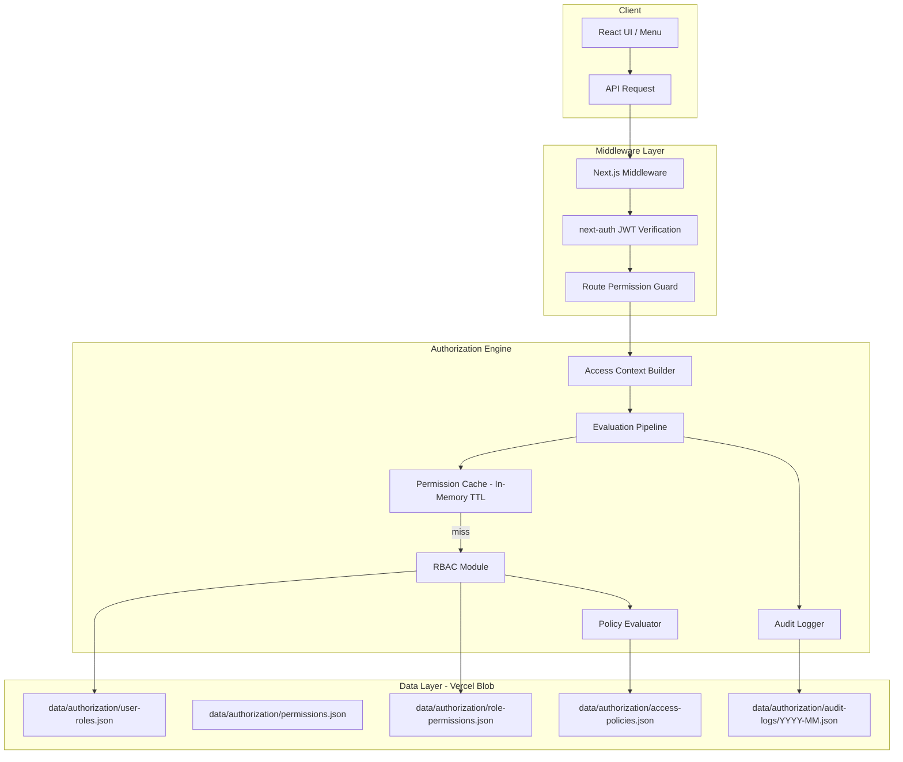
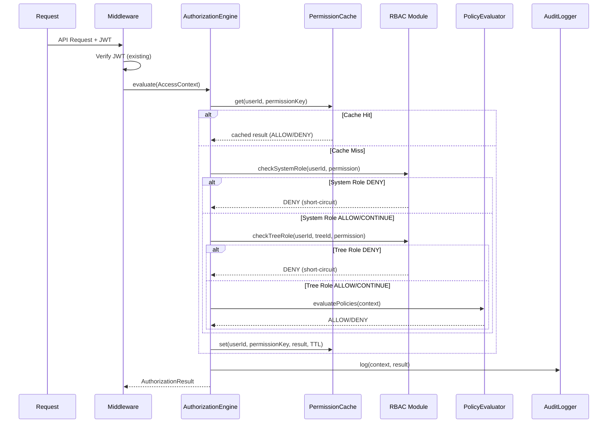

# Design Document - Hệ Thống Quản Lý Phân Quyền (Authorization System)

## Overview

Hệ thống phân quyền mở rộng cơ chế RBAC hiện có (`src/lib/auth/rbac.ts`) thành kiến trúc phân quyền đa tầng, hỗ trợ:

- **System Roles** (SUPER_ADMIN, ADMIN, MEMBER) - quản lý quyền toàn hệ thống
- **Tree Roles** (TREE_ADMIN, TREE_EDITOR, TREE_VIEWER) - quản lý quyền cấp cây gia phả (mở rộng từ ADMIN/EDITOR/VIEWER hiện tại)
- **Permission Registry** - đăng ký quyền theo pattern `resource:action`
- **Policy Evaluator** - đánh giá chính sách ABAC cho data-level access control
- **Permission Cache** - TTL-based cache tối ưu hiệu năng
- **Audit Logger** - ghi log kiểm toán

### Nguyên tắc thiết kế

1. **Backward Compatibility**: Map ADMIN→TREE_ADMIN, EDITOR→TREE_EDITOR, VIEWER→TREE_VIEWER
2. **JSON Blob Storage**: Sử dụng Vercel Blob (Supabase Storage) thay vì SQL tables
3. **Existing Infrastructure**: Tận dụng next-auth JWT, middleware pattern hiện có
4. **Deny-by-default**: Mọi truy cập bị từ chối trừ khi được cấp rõ ràng
5. **Fail-closed**: Lỗi hệ thống → từ chối truy cập


## Architecture

### High-Level Architecture Diagram



### Evaluation Pipeline Flow




## Components and Interfaces

### 1. Authorization Engine (`src/lib/auth/authorization-engine.ts`)

Module trung tâm điều phối toàn bộ quy trình đánh giá quyền.

```typescript
// Types
interface AccessContext {
  user: { id: string; systemRole: SystemRole };
  resource: { type: ResourceType; id?: string; treeId?: string };
  action: ActionType;
  environment: { timestamp: number; ip?: string };
}

type AuthorizationDecision = 'ALLOW' | 'DENY';

interface AuthorizationResult {
  decision: AuthorizationDecision;
  reason: string;
  evaluatedBy: 'cache' | 'system-role' | 'tree-role' | 'policy';
}

// Main API
function evaluate(context: AccessContext): Promise<AuthorizationResult>;
function evaluateSync(context: AccessContext): AuthorizationResult; // for cached
function buildAccessContext(request: NextRequest, token: JWT): AccessContext;
```

### 2. RBAC Module (`src/lib/auth/rbac-module.ts`)

Mở rộng `rbac.ts` hiện tại, thêm System Roles và Permission Registry.

```typescript
// System Roles
type SystemRole = 'SUPER_ADMIN' | 'ADMIN' | 'MEMBER';

// Extended Tree Roles (backward compatible)
type ExtendedTreeRole = 'TREE_ADMIN' | 'TREE_EDITOR' | 'TREE_VIEWER';

// Role Hierarchy
const SYSTEM_ROLE_HIERARCHY: Record<SystemRole, number> = {
  SUPER_ADMIN: 3,
  ADMIN: 2,
  MEMBER: 1,
};

// Permission check functions
function hasSystemPermission(role: SystemRole, permission: Permission): boolean;
function hasTreePermission(role: ExtendedTreeRole, permission: Permission): boolean;
function getEffectiveTreeRole(userId: string, treeId: string, systemRole: SystemRole): ExtendedTreeRole | null;
function getUserSystemRole(userId: string): Promise<SystemRole>;
function assignSystemRole(userId: string, newRole: SystemRole, assignedBy: string): Promise<void>;
function assignTreeRole(userId: string, treeId: string, role: ExtendedTreeRole, invitedBy: string): Promise<void>;
```

### 3. Permission Registry (`src/lib/auth/permission-registry.ts`)

```typescript
type ResourceType = 'tree' | 'member' | 'media' | 'report' | 'user' | 'system' | 'event' | 'album';
type ActionType = 'create' | 'read' | 'update' | 'delete';
type Permission = `${ResourceType}:${ActionType}`;

interface PermissionDefinition {
  id: string;
  resource: ResourceType;
  action: ActionType;
  description: string;
}

// API
function getAllPermissions(): PermissionDefinition[];
function getPermissionsByResource(resource: ResourceType): PermissionDefinition[];
function registerPermission(definition: PermissionDefinition): void;
function isValidPermission(permission: string): permission is Permission;
```


### 4. Policy Evaluator (`src/lib/auth/policy-evaluator.ts`)

ABAC engine cho data-level access control.

```typescript
type PolicyEffect = 'ALLOW' | 'DENY';

interface PolicyCondition {
  field: string;                    // e.g., 'resource.treeId', 'user.systemRole'
  operator: 'eq' | 'neq' | 'in' | 'nin' | 'exists' | 'gt' | 'lt';
  value: unknown;
}

interface AccessPolicy {
  id: string;
  name: string;
  resource: ResourceType;
  conditions: PolicyCondition[];
  effect: PolicyEffect;
  priority: number;               // higher = evaluated first
}

// API
function evaluatePolicies(context: AccessContext, policies: AccessPolicy[]): AuthorizationDecision;
function getApplicablePolicies(context: AccessContext): Promise<AccessPolicy[]>;
function matchesCondition(condition: PolicyCondition, context: AccessContext): boolean;
```

### 5. Permission Cache (`src/lib/auth/permission-cache.ts`)

In-memory TTL cache (không cần Redis cho scale hiện tại).

```typescript
interface CacheEntry {
  decision: AuthorizationDecision;
  expiresAt: number;
  evaluatedAt: number;
}

interface CacheConfig {
  systemRoleTTL: number;    // default 300s
  treeRoleTTL: number;      // default 60s
  maxEntries: number;       // default 10000
}

// API
function get(userId: string, permissionKey: string): CacheEntry | null;
function set(userId: string, permissionKey: string, decision: AuthorizationDecision, ttl: number): void;
function invalidateUser(userId: string): void;
function invalidateRole(role: string): void;
function invalidateAll(): void;
function generateCacheKey(userId: string, resource: string, action: string, treeId?: string): string;
```

### 6. Audit Logger (`src/lib/auth/audit-logger.ts`)

```typescript
interface AuditLogEntry {
  id: string;
  userId: string;
  action: string;
  resourceType: ResourceType;
  resourceId?: string;
  decision: AuthorizationDecision;
  reason: string;
  evaluatedPolicies?: string[];
  timestamp: string;
}

interface RoleChangeLogEntry {
  id: string;
  targetUserId: string;
  performedBy: string;
  changeType: 'ASSIGN' | 'REMOVE' | 'CHANGE';
  roleScope: 'SYSTEM' | 'TREE';
  previousRole?: string;
  newRole?: string;
  treeId?: string;
  timestamp: string;
}

// API
function logAuthorizationDecision(entry: AuditLogEntry): Promise<void>;
function logRoleChange(entry: RoleChangeLogEntry): Promise<void>;
function queryLogs(filter: AuditLogFilter): Promise<AuditLogEntry[]>;
```

### 7. Route Permission Config (`src/lib/auth/route-permissions.ts`)

Cấu hình tập trung quyền yêu cầu cho mỗi route.

```typescript
interface RoutePermission {
  path: string;                         // glob pattern, e.g., '/api/trees/:treeId/members'
  method: 'GET' | 'POST' | 'PUT' | 'DELETE' | '*';
  requiredPermission: Permission;
  requireTreeMembership?: boolean;
  requiredSystemRoles?: SystemRole[];
}

const ROUTE_PERMISSIONS: RoutePermission[] = [
  { path: '/api/admin/*', method: '*', requiredPermission: 'system:read', requiredSystemRoles: ['ADMIN', 'SUPER_ADMIN'] },
  { path: '/api/trees/:treeId/members', method: 'GET', requiredPermission: 'member:read', requireTreeMembership: true },
  { path: '/api/trees/:treeId/members', method: 'POST', requiredPermission: 'member:create', requireTreeMembership: true },
  // ... more routes
];

function getRoutePermission(path: string, method: string): RoutePermission | null;
function matchRoute(pattern: string, path: string): boolean;
```


### 8. Backward Compatibility Layer (`src/lib/auth/compatibility.ts`)

```typescript
// Map legacy TreeRole to new ExtendedTreeRole
function mapLegacyTreeRole(legacyRole: 'ADMIN' | 'EDITOR' | 'VIEWER'): ExtendedTreeRole {
  const mapping = { ADMIN: 'TREE_ADMIN', EDITOR: 'TREE_EDITOR', VIEWER: 'TREE_VIEWER' };
  return mapping[legacyRole];
}

// Map new ExtendedTreeRole to legacy TreeRole (for existing code)
function mapToLegacyTreeRole(role: ExtendedTreeRole): 'ADMIN' | 'EDITOR' | 'VIEWER' {
  const mapping = { TREE_ADMIN: 'ADMIN', TREE_EDITOR: 'EDITOR', TREE_VIEWER: 'VIEWER' };
  return mapping[role];
}

// Legacy permission mapping
function mapLegacyPermission(legacy: 'READ' | 'CREATE' | 'UPDATE' | 'DELETE' | 'ASSIGN_ROLE'): Permission[];
```

### 9. Data Masking Service (`src/lib/auth/data-masking.ts`)

```typescript
interface MaskingRule {
  resourceType: ResourceType;
  fields: string[];
  condition: (context: AccessContext, resource: unknown) => boolean;
}

// Ẩn thông tin nhạy cảm thành viên còn sống
const LIVING_MEMBER_MASKING: MaskingRule = {
  resourceType: 'member',
  fields: ['dateOfBirth', 'currentAddress', 'phone', 'email'],
  condition: (ctx, member) => (member as Member).isAlive && !hasDetailViewPermission(ctx),
};

function applyMasking<T>(data: T, context: AccessContext, rules: MaskingRule[]): T;
function hasDetailViewPermission(context: AccessContext): boolean;
```

## Data Models

### JSON Blob Storage Paths

Tất cả dữ liệu phân quyền được lưu dưới dạng JSON files trong Vercel Blob (Supabase Storage):

```typescript
// Mở rộng BLOB_PATHS hiện có
export const AUTH_BLOB_PATHS = {
  // System role assignments
  userRoles: () => 'data/authorization/user-roles.json',
  
  // Permission definitions
  permissions: () => 'data/authorization/permissions.json',
  
  // Role-permission mappings
  rolePermissions: () => 'data/authorization/role-permissions.json',
  
  // Access policies (ABAC rules)
  accessPolicies: () => 'data/authorization/access-policies.json',
  
  // Audit logs (partitioned by month)
  auditLogs: (yearMonth: string) => `data/authorization/audit-logs/${yearMonth}.json`,
  
  // Route permission config
  routePermissions: () => 'data/authorization/route-permissions.json',
} as const;
```


### Data Schemas (Zod)

```typescript
// user-roles.json schema
const userRoleEntrySchema = z.object({
  userId: z.string(),
  systemRole: z.enum(['SUPER_ADMIN', 'ADMIN', 'MEMBER']),
  assignedBy: z.string(),
  assignedAt: z.string().datetime(),
});
type UserRoleEntry = z.infer<typeof userRoleEntrySchema>;
// File content: UserRoleEntry[]

// permissions.json schema
const permissionDefinitionSchema = z.object({
  id: z.string(),
  resource: z.enum(['tree', 'member', 'media', 'report', 'user', 'system', 'event', 'album']),
  action: z.enum(['create', 'read', 'update', 'delete']),
  description: z.string(),
});
type PermissionDefinition = z.infer<typeof permissionDefinitionSchema>;
// File content: PermissionDefinition[]

// role-permissions.json schema
const rolePermissionMappingSchema = z.object({
  roleType: z.enum(['SYSTEM', 'TREE']),
  roleName: z.string(),
  permissionIds: z.array(z.string()),
});
type RolePermissionMapping = z.infer<typeof rolePermissionMappingSchema>;
// File content: RolePermissionMapping[]

// access-policies.json schema
const policyConditionSchema = z.object({
  field: z.string(),
  operator: z.enum(['eq', 'neq', 'in', 'nin', 'exists', 'gt', 'lt']),
  value: z.unknown(),
});

const accessPolicySchema = z.object({
  id: z.string(),
  name: z.string(),
  resource: z.enum(['tree', 'member', 'media', 'report', 'user', 'system', 'event', 'album']),
  conditions: z.array(policyConditionSchema),
  effect: z.enum(['ALLOW', 'DENY']),
  priority: z.number().int().min(0),
});
type AccessPolicy = z.infer<typeof accessPolicySchema>;
// File content: AccessPolicy[]

// audit-logs/YYYY-MM.json schema
const auditLogEntrySchema = z.object({
  id: z.string(),
  userId: z.string(),
  action: z.string(),
  resourceType: z.string(),
  resourceId: z.string().optional(),
  decision: z.enum(['ALLOW', 'DENY']),
  reason: z.string(),
  evaluatedPolicies: z.array(z.string()).optional(),
  timestamp: z.string().datetime(),
});
type AuditLogEntry = z.infer<typeof auditLogEntrySchema>;
// File content: AuditLogEntry[]
```

### Tree Memberships (Mở rộng cấu trúc hiện có)

Cấu trúc `FamilyTree.memberships` hiện tại vẫn được giữ nguyên để backward compatible. Hệ thống mới sẽ map legacy `TreeRole` sang `ExtendedTreeRole` tại runtime:

```typescript
// Existing (giữ nguyên trong data/trees.json)
interface TreeMembership {
  userId: string;
  role: TreeRole;       // 'ADMIN' | 'EDITOR' | 'VIEWER'
  createdAt: string;
}

// Runtime mapping (không thay đổi schema)
// ADMIN → TREE_ADMIN, EDITOR → TREE_EDITOR, VIEWER → TREE_VIEWER
```

### Role-Permission Default Mappings

```typescript
const DEFAULT_SYSTEM_ROLE_PERMISSIONS: Record<SystemRole, Permission[]> = {
  MEMBER: ['tree:read', 'member:read', 'media:read', 'event:read', 'album:read'],
  ADMIN: [
    // inherits MEMBER +
    'user:read', 'user:update', 'system:read', 'report:read', 'report:create',
  ],
  SUPER_ADMIN: [
    // inherits ADMIN +
    'user:create', 'user:delete', 'system:update', 'system:delete',
  ],
};

const DEFAULT_TREE_ROLE_PERMISSIONS: Record<ExtendedTreeRole, Permission[]> = {
  TREE_VIEWER: ['tree:read', 'member:read', 'media:read', 'event:read', 'album:read'],
  TREE_EDITOR: [
    // inherits TREE_VIEWER +
    'member:create', 'member:update', 'media:create', 'media:update',
    'event:create', 'event:update', 'album:create', 'album:update',
  ],
  TREE_ADMIN: [
    // inherits TREE_EDITOR +
    'member:delete', 'media:delete', 'event:delete', 'album:delete',
    'tree:update', 'tree:delete',
  ],
};
```


## Correctness Properties

*Một property là một đặc tính hoặc hành vi luôn đúng trong mọi trường hợp thực thi hợp lệ của hệ thống — thực chất là một phát biểu hình thức về những gì hệ thống phải làm. Properties là cầu nối giữa đặc tả dễ đọc cho con người và đảm bảo tính đúng đắn có thể kiểm chứng bằng máy.*

### Property 1: Role Hierarchy Inheritance

*For any* permission P và hai System_Role R1, R2 trong đó hierarchy(R1) > hierarchy(R2), nếu R2 có quyền P thì R1 cũng có quyền P.

Cụ thể: mọi permission của MEMBER cũng thuộc ADMIN, và mọi permission của ADMIN cũng thuộc SUPER_ADMIN.

**Validates: Requirements 1.2**

### Property 2: Single System Role Invariant

*For any* user trong hệ thống, tại bất kỳ thời điểm nào, user đó có chính xác một System_Role. Không có trường hợp user có 0 hoặc nhiều hơn 1 system role.

**Validates: Requirements 1.4**

### Property 3: SUPER_ADMIN Tree Override

*For any* cây gia phả T và *for any* user U có SystemRole = SUPER_ADMIN, khi đánh giá quyền truy cập cây T, effective tree role của U luôn là TREE_ADMIN, bất kể U có membership trên T hay không.

**Validates: Requirements 2.4**

### Property 4: Tree Role Determines Permitted Actions

*For any* user U với Tree_Role R trên cây T, và *for any* action A trên tài nguyên thuộc cây T:
- Nếu R = TREE_VIEWER: chỉ action `read` được phép, mọi action `create`, `update`, `delete` bị từ chối
- Nếu R = TREE_EDITOR: `read`, `create`, `update` trên members/media/events được phép; `delete` members và thay đổi config cây bị từ chối
- Nếu R = TREE_ADMIN: mọi action đều được phép

**Validates: Requirements 5.1, 5.2, 5.3**

### Property 5: Owner Full Access

*For any* tài nguyên R và *for any* user U là chủ sở hữu (owner) của R, mọi action CRUD trên R đều được phép cho U.

**Validates: Requirements 5.4**

### Property 6: Composite Dual Authorization

*For any* yêu cầu truy cập dữ liệu từ cây nguồn S thông qua cây composite C, truy cập chỉ được phép KHI VÀ CHỈ KHI cả hai điều kiện thỏa mãn: (1) user có quyền đọc trên composite C, VÀ (2) cây nguồn S đã consent cho phép composite sharing.

**Validates: Requirements 5.5**

### Property 7: Sensitive Data Masking

*For any* member M với `isAlive = true` và *for any* user U không có quyền xem chi tiết trên cây chứa M, các trường nhạy cảm (dateOfBirth, currentAddress, phone, email) trong kết quả trả về cho U phải bị mask (null hoặc redacted).

**Validates: Requirements 5.6**

### Property 8: Deny-Fast Short-Circuit

*For any* AccessContext C được đánh giá qua pipeline gồm N bước, nếu bước thứ K (K < N) trả về DENY, thì kết quả cuối cùng là DENY và các bước K+1 đến N không được thực thi.

**Validates: Requirements 7.4**

### Property 9: Deny-Overrides Conflict Resolution

*For any* tập hợp policies P1, P2, ..., Pn áp dụng cho cùng một AccessContext, nếu tồn tại ít nhất một policy Pi có effect = DENY, thì kết quả đánh giá cuối cùng là DENY, bất kể các policy khác có effect gì.

**Validates: Requirements 7.5**

### Property 10: Default Deny (Least Privilege)

*For any* user U và *for any* resource R và action A, nếu không tồn tại bất kỳ quy tắc phân quyền nào (role mapping hoặc policy) cấp quyền cho (U, R, A), thì kết quả đánh giá là DENY.

**Validates: Requirements 10.1**

### Property 11: Fail-Closed on Error

*For any* lỗi xảy ra trong quá trình đánh giá quyền (database timeout, cache failure, parsing error), kết quả trả về luôn là DENY, không bao giờ là ALLOW.

**Validates: Requirements 10.3**

### Property 12: Non-Admin Role Change Denied

*For any* user U có Tree_Role là TREE_EDITOR hoặc TREE_VIEWER trên cây T, và *for any* user V khác, khi U cố gắng thay đổi Tree_Role của V trên cây T, kết quả luôn là FORBIDDEN.

**Validates: Requirements 2.6**

### Property 13: Permission Format Invariant

*For any* permission P đã đăng ký trong Permission_Registry, P phải match pattern `^[a-z]+:[a-z]+$` (tức format `resource:action`).

**Validates: Requirements 3.1**

### Property 14: Audit Log Entry Completeness

*For any* authorization event E (bao gồm role changes và access denials), audit log entry được tạo ra phải chứa đầy đủ các trường: timestamp, userId, action, resourceType, decision, và reason.

**Validates: Requirements 1.5, 9.4**


## Error Handling

### Error Types

```typescript
type AuthorizationErrorCode =
  | 'UNAUTHENTICATED'        // No valid session/JWT
  | 'PERMISSION_DENIED'      // User lacks required permission
  | 'FORBIDDEN'              // Explicit deny (role change attempt by non-admin)
  | 'TREE_NOT_FOUND'         // Tree doesn't exist
  | 'INVALID_PERMISSION'     // Permission format invalid
  | 'POLICY_EVALUATION_ERROR' // Error during policy evaluation
  | 'CACHE_ERROR'            // Cache read/write failure (non-fatal, fallback to direct eval)
  | 'STORAGE_ERROR';         // Blob storage read failure

class AuthorizationError extends Error {
  constructor(
    public readonly code: AuthorizationErrorCode,
    message: string,
    public readonly statusCode: number = 403,
  ) {
    super(message);
    this.name = 'AuthorizationError';
  }
}
```

### Error Response Format (Client-facing)

```typescript
// Sanitized response - KHÔNG tiết lộ cấu trúc quyền nội bộ
interface AuthorizationErrorResponse {
  ok: false;
  error: {
    code: 'PERMISSION_DENIED' | 'UNAUTHENTICATED';
    message: string;  // Generic: "You do not have permission to perform this action"
  };
}
```

### Error Handling Strategy

| Scenario | Internal Behavior | Client Response |
|----------|------------------|-----------------|
| No JWT | Skip evaluation | 401 UNAUTHENTICATED |
| Valid JWT, no permission | DENY + audit log | 403 PERMISSION_DENIED |
| Role change by non-admin | DENY + audit log | 403 PERMISSION_DENIED |
| Blob storage error | Fail-closed (DENY) + error log | 403 PERMISSION_DENIED |
| Cache error | Fallback to direct evaluation | Transparent to client |
| Invalid permission format | DENY + warning log | 403 PERMISSION_DENIED |
| Policy evaluation error | Fail-closed (DENY) + error log | 403 PERMISSION_DENIED |

### Fail-Closed Implementation

```typescript
async function evaluate(context: AccessContext): Promise<AuthorizationResult> {
  try {
    // Normal evaluation pipeline
    return await runEvaluationPipeline(context);
  } catch (error) {
    // Fail-closed: any error → DENY
    await auditLogger.logError(context, error);
    return { decision: 'DENY', reason: 'evaluation-error', evaluatedBy: 'system-role' };
  }
}
```


## Testing Strategy

### Property-Based Testing (fast-check)

Sử dụng **fast-check** (đã có trong devDependencies) với **vitest** để implement các Correctness Properties.

**Cấu hình:**
- Minimum 100 iterations mỗi property test
- Mỗi test reference design property tương ứng
- Tag format: `Feature: authorization-system, Property {number}: {property_text}`

**Test file locations:**
- `tests/property/authorization/role-hierarchy.property.test.ts`
- `tests/property/authorization/evaluation-pipeline.property.test.ts`
- `tests/property/authorization/policy-evaluator.property.test.ts`
- `tests/property/authorization/data-masking.property.test.ts`

**Generators cần tạo:**
```typescript
// Arbitrary generators cho fast-check
const arbSystemRole = fc.constantFrom('SUPER_ADMIN', 'ADMIN', 'MEMBER');
const arbTreeRole = fc.constantFrom('TREE_ADMIN', 'TREE_EDITOR', 'TREE_VIEWER');
const arbResourceType = fc.constantFrom('tree', 'member', 'media', 'report', 'user', 'system', 'event', 'album');
const arbActionType = fc.constantFrom('create', 'read', 'update', 'delete');
const arbPermission = fc.tuple(arbResourceType, arbActionType).map(([r, a]) => `${r}:${a}`);
const arbPolicyEffect = fc.constantFrom('ALLOW', 'DENY');
const arbAccessContext = fc.record({
  user: fc.record({ id: fc.uuid(), systemRole: arbSystemRole }),
  resource: fc.record({ type: arbResourceType, id: fc.uuid(), treeId: fc.option(fc.uuid()) }),
  action: arbActionType,
  environment: fc.record({ timestamp: fc.nat() }),
});
```

### Unit Tests (vitest)

**Test file locations:**
- `tests/unit/authorization/rbac-module.test.ts`
- `tests/unit/authorization/permission-registry.test.ts`
- `tests/unit/authorization/permission-cache.test.ts`
- `tests/unit/authorization/audit-logger.test.ts`
- `tests/unit/authorization/compatibility.test.ts`
- `tests/unit/authorization/route-permissions.test.ts`

**Specific examples to test:**
- MEMBER cannot access admin pages
- TREE_EDITOR can create members but cannot delete them
- Cache TTL expiration behavior
- Legacy role mapping correctness
- Route pattern matching edge cases
- Audit log entry format with real scenarios

### Integration Tests

**Test scenarios:**
- End-to-end evaluation pipeline: request → middleware → engine → response
- Cache invalidation on role change (timing)
- Blob storage read/write for authorization data
- Backward compatibility: existing API routes still work with legacy roles
- Composite tree authorization with source consent

### Test Coverage Targets

| Component | Unit | Property | Integration |
|-----------|------|----------|-------------|
| RBAC Module | ✅ | ✅ (P1, P2, P3, P4) | ✅ |
| Permission Registry | ✅ | ✅ (P13) | - |
| Policy Evaluator | ✅ | ✅ (P9, P10) | ✅ |
| Permission Cache | ✅ | - | ✅ |
| Audit Logger | ✅ | ✅ (P14) | ✅ |
| Authorization Engine | ✅ | ✅ (P8, P10, P11) | ✅ |
| Data Masking | ✅ | ✅ (P7) | - |
| Compatibility Layer | ✅ | - | ✅ |
| Route Permissions | ✅ | - | ✅ |

