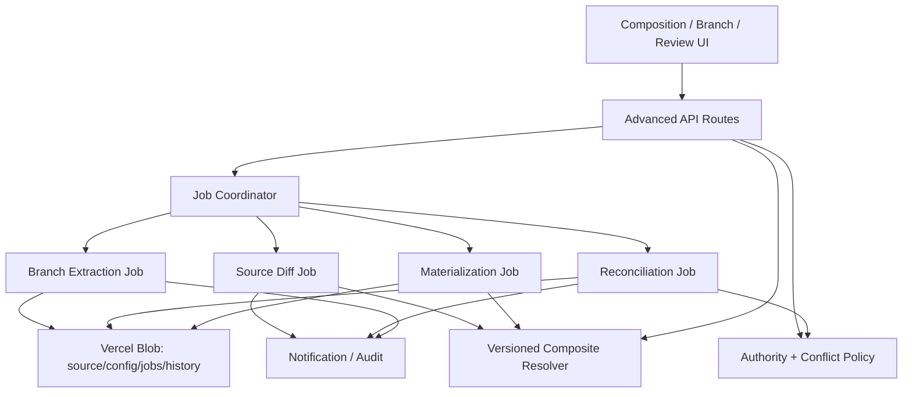

# Design Document: Composite Family Trees (Advanced / Deferred)

## Status

**DEFERRED**

This document is implementable after the MVP in
`../composite-family-trees` is complete. It is intentionally separate because
it introduces asynchronous copy jobs and controlled writes to standalone
sources. It must not weaken the MVP rule that a composite is read-only unless
an authority and conflict policy have been explicitly configured.

## Design Principles

1. A split is a recoverable fork, never a destructive move.
2. Origin references are immutable lineage metadata, not a permission bypass.
3. All synchronization is explicit and human-reviewable.
4. Every write has one authority source and an expected version.
5. Materialization creates a new standalone tree; it does not mutate sources.
6. Nested composites form a bounded dependency DAG, never an arbitrary graph.
7. Jobs are idempotent, resumable and auditable.

## Architecture



The existing serverless deployment may implement the coordinator using a
durable job document plus Vercel Cron/short requests. A request must never hold
an entire large extraction or materialization open.

## Data Models

### Origin references

```typescript
export interface OriginReference {
  originTreeId: string;
  originEntityId: string;
  originEntityType: 'MEMBER' | 'RELATIONSHIP' | 'EVENT' | 'MEDIA';
  originRevision: string;
  extractionId: string;
  copiedAt: string;
}

export interface ExtractedEntityManifest {
  newEntityId: string;
  origins: OriginReference[];
  checksum: string;
}
```

Origin references are stored in a separate manifest rather than adding optional
fields to every original domain interface. This prevents ordinary standalone
imports from depending on advanced lineage metadata.

### Branch extraction

```typescript
export type BranchScope =
  | 'DESCENDANTS'
  | 'DESCENDANTS_WITH_SPOUSES'
  | 'SELECTED_MEMBERS';

export type AncestorContext = 'NONE' | 'BOUNDARY_ONLY' | 'ANCESTORS_TO_ROOT';

export interface BranchExtractionRequest {
  sourceTreeId: string;
  targetName: string;
  targetDescription?: string;
  anchorMemberIds: string[];
  scope: BranchScope;
  ancestorContext: AncestorContext;
  copyEvents: boolean;
  copyMedia: boolean;
  copyLivingSensitiveFields: boolean;
}

export interface ExtractionJob {
  id: string;
  type: 'BRANCH_EXTRACTION' | 'SOURCE_DIFF' | 'RECONCILIATION' | 'MATERIALIZE';
  status: 'DRAFT' | 'QUEUED' | 'RUNNING' | 'PAUSED' | 'SUCCEEDED' | 'FAILED' | 'CANCELLED';
  sourceTreeIds: string[];
  targetTreeId?: string;
  requestedBy: string;
  sourceVersions: Record<string, string>;
  progress: { completed: number; total: number; phase: string };
  errorCode?: string;
  errorMessage?: string;
  createdAt: string;
  updatedAt: string;
}
```

### Version manifests and diffs

```typescript
export interface SourceVersionManifest {
  treeId: string;
  membersHash: string;
  relationshipsHash: string;
  eventsHash: string;
  mediaMetadataHash: string;
  treeUpdatedAt: string;
  capturedAt: string;
}

export type ChangeDiffKind =
  | 'CREATE'
  | 'UPDATE'
  | 'DELETE'
  | 'LINK_CHANGE'
  | 'PERMISSION_CHANGE'
  | 'SOURCE_UNAVAILABLE';

export interface ChangeDiff {
  id: string;
  compositeTreeId: string;
  sourceTreeId: string;
  entityType: 'MEMBER' | 'RELATIONSHIP' | 'EVENT' | 'MEDIA';
  sourceEntityId: string;
  identityGroupId?: string;
  kind: ChangeDiffKind;
  previousData?: Record<string, unknown>;
  currentData?: Record<string, unknown>;
  changedFields: string[];
  fromVersion: SourceVersionManifest;
  toVersion: SourceVersionManifest;
  status: 'OPEN' | 'IN_REVIEW' | 'ACCEPTED' | 'REJECTED' | 'DEFERRED';
  createdAt: string;
  updatedAt: string;
}
```

Sensitive fields must be encrypted or omitted according to the same audience
policy used by the MVP. A diff is not permission to expose the previous value.

### Decisions and conflicts

```typescript
export interface FieldDecision {
  field: string;
  action: 'KEEP_CURRENT' | 'TAKE_SOURCE' | 'CLEAR' | 'DEFER';
  sourceReference?: SourceReference;
  value?: unknown;
}

export interface ReconciliationDecision {
  id: string;
  diffId: string;
  actorId: string;
  decisions: FieldDecision[];
  target: 'COMPOSITE_ONLY' | 'AUTHORITY_SOURCE' | 'NEW_SNAPSHOT';
  status: 'ACCEPTED' | 'REJECTED' | 'DEFERRED' | 'PENDING_SOURCE_ACTION';
  reason: string;
  expectedSourceVersion?: string;
  createdAt: string;
}

export interface CompositeConflict {
  id: string;
  compositeTreeId: string;
  identityGroupId?: string;
  diffIds: string[];
  fields: string[];
  status: 'OPEN' | 'RESOLVED' | 'DEFERRED';
  createdAt: string;
  updatedAt: string;
}
```

### Authority policy

```typescript
export interface AuthorityPolicy {
  compositeTreeId: string;
  identityGroupId: string;
  defaultSource: SourceReference;
  fieldSources: Record<string, SourceReference>;
  relationshipSource?: SourceReference;
  updatedAt: string;
}
```

The policy is a routing rule, not a copy of source data. A mutation routed to a
source must include `expectedSourceVersion` and use a conditional update or an
equivalent compare-and-swap protocol.

### Materialized snapshot

```typescript
export interface MaterializationManifest {
  id: string;
  compositeTreeId: string;
  targetTreeId: string;
  compositeRevision: number;
  sourceVersions: SourceVersionManifest[];
  identityGroupIds: string[];
  conflictPolicy: 'PREFERRED_SOURCE' | 'NON_EMPTY' | 'MANUAL_DECISIONS';
  entityManifests: ExtractedEntityManifest[];
  createdBy: string;
  createdAt: string;
}
```

## Storage Layout

```typescript
const ADVANCED_BLOB_PATHS = {
  originManifest: (treeId: string, extractionId: string) =>
    `data/trees/${treeId}/origin-manifests/${extractionId}.json`,
  extractionJob: (jobId: string) => `jobs/composite/${jobId}.json`,
  sourceManifest: (compositeTreeId: string, sourceTreeId: string) =>
    `data/trees/${compositeTreeId}/source-versions/${sourceTreeId}.json`,
  diff: (compositeTreeId: string, diffId: string) =>
    `data/trees/${compositeTreeId}/diffs/${diffId}.json`,
  decision: (compositeTreeId: string, decisionId: string) =>
    `data/trees/${compositeTreeId}/decisions/${decisionId}.json`,
  conflict: (compositeTreeId: string, conflictId: string) =>
    `data/trees/${compositeTreeId}/conflicts/${conflictId}.json`,
  authority: (compositeTreeId: string, identityGroupId: string) =>
    `data/trees/${compositeTreeId}/authority/${identityGroupId}.json`,
  materialization: (manifestId: string) =>
    `data/trees/materialization-manifests/${manifestId}.json`,
};
```

Jobs and diffs are append-friendly documents. A compacted index may be added
after correctness is established. Job retry must be idempotent by `(jobId,
phase, batchChecksum)`.

## Branch Extraction Algorithm

1. Authorize source READ and target-tree creation.
2. Snapshot all source versions before reading domain blobs.
3. Resolve the selected branch using canonical parent-child edges; include
   direct spouses according to policy and ancestor context according to request.
4. Preview counts, private-field redaction, media bytes and quota usage.
5. Create a draft target tree and extraction job.
6. Copy members with new IDs and build an old→new map.
7. Copy relationships whose endpoints were copied; rewrite both endpoints.
8. Copy events and media metadata using rewritten references. Binary media is
   copied only after metadata/size quota preflight.
9. Write OriginReference manifests and per-batch checksums.
10. Verify counts, referential integrity, relationship acyclicity and checksums.
11. Publish target tree and extraction manifest in one final state transition.
12. If any phase fails, resume from the last verified batch or rollback the
    draft. Never expose a partially populated target as a normal tree.

The source is not locked during extraction. If source versions change during
the job, the job finishes against its captured snapshot and reports drift;
the user can rerun or reconcile after completion.

## Diff Algorithm

1. Read the previous SourceVersionManifest and current source versions.
2. If hashes match, return no diff.
3. Load only changed entity collections where possible.
4. Match entities by immutable origin references first, then source IDs for
   records that were not extracted, never by mutable names alone.
5. Produce normalized field-level diffs and relationship link diffs.
6. Map source references to IdentityGroups and group compatible changes.
7. Create conflicts for incompatible values or competing deletes.
8. Persist an idempotency key from source ID and from/to version hashes.
9. Notify assigned reviewers without including restricted values.

## Reconciliation Algorithm

1. Check the reviewer's current permissions and load the diff's source versions.
2. Lock the diff logically with `IN_REVIEW`; do not lock source blobs.
3. Display field candidates with provenance, dates and reasons.
4. Require an explicit FieldDecision for every conflicting field.
5. Validate decisions against privacy policy, schema, date constraints and
   relationship cycle rules.
6. For `COMPOSITE_ONLY`, persist a composite overlay decision that affects the
   projection but not source data.
7. For `AUTHORITY_SOURCE`, issue a source mutation with expected version. On a
   version mismatch, create a new conflict and leave the source unchanged.
8. For `NEW_SNAPSHOT`, defer writing source records until materialization.
9. Append immutable decision/audit records and update diff status.

Composite overlays must be explicitly limited to fields supported by the
product. They are not an accidental second source of truth; the UI must label
them as “overview override” and show their expiry/review status.

## Nested Composite Resolution

Nested resolution is an opt-in feature flag. Before loading data:

1. Build a graph of composite dependencies from published configurations.
2. Run cycle detection and depth/source-count limits.
3. Resolve leaves first, carrying an immutable provenance chain.
4. Apply identity groups at each boundary and normalize IDs with namespace
   prefixes so equivalent identities do not collide accidentally.
5. Propagate the strictest source privacy policy and the freshest/stalest
   status upward.

If any dependency is unavailable, the parent result records a dependency
warning and never silently substitutes a stale result as fresh.

## Materialization Algorithm

1. Resolve composite for the requesting user and capture all source versions.
2. Preview conflicts, redactions, unavailable sources and output quota.
3. Require an explicit field merge policy or completed manual decisions.
4. Create a draft standalone target and new IDs for every virtual entity.
5. Copy resolved records, rewrite relationships/events/media and write origin
   manifests referencing every contributing source.
6. Validate the resulting standalone tree with the original services.
7. Write MaterializationManifest and publish target only after validation.
8. Keep the composite and all source trees unchanged.

## API Surface

```text
POST   /api/trees/:treeId/branch-extractions/preview
POST   /api/trees/:treeId/branch-extractions
GET    /api/jobs/composite/:jobId
POST   /api/jobs/composite/:jobId/cancel
GET    /api/trees/:treeId/composition/diffs
GET    /api/trees/:treeId/composition/diffs/:diffId
POST   /api/trees/:treeId/composition/diffs/:diffId/claim
POST   /api/trees/:treeId/composition/diffs/:diffId/decisions
GET    /api/trees/:treeId/composition/conflicts
PUT    /api/trees/:treeId/composition/authority/:identityGroupId
POST   /api/trees/:treeId/materializations/preview
POST   /api/trees/:treeId/materializations
GET    /api/materializations/:manifestId
POST   /api/trees/:treeId/composition/nested-sources
DELETE /api/trees/:treeId/composition/nested-sources/:sourceId
```

Job endpoints must be idempotent and return progress tokens. Mutation endpoints
must include expected config/source revision and return conflict details rather
than overwriting newer data.

## Error Handling

```typescript
type AdvancedCompositeErrorCode =
  | 'EXTRACTION_SCOPE_INVALID'
  | 'EXTRACTION_QUOTA_EXCEEDED'
  | 'EXTRACTION_CHECKSUM_FAILED'
  | 'EXTRACTION_SOURCE_DRIFT'
  | 'JOB_NOT_RESUMABLE'
  | 'DIFF_VERSION_MISMATCH'
  | 'CONFLICT_REQUIRES_DECISION'
  | 'AUTHORITY_UNAVAILABLE'
  | 'PENDING_SOURCE_ACTION'
  | 'SOURCE_WRITE_CONFLICT'
  | 'NESTED_COMPOSITE_CYCLE'
  | 'NESTED_COMPOSITE_DEPTH_EXCEEDED'
  | 'MATERIALIZATION_POLICY_REQUIRED'
  | 'MATERIALIZATION_QUOTA_EXCEEDED'
  | 'MATERIALIZATION_VALIDATION_FAILED';
```

Failures must identify a recoverable action: resume, retry, review, change
policy, request permission or cancel. A failure response must never include
private source values merely because a job administrator can see job status.

## Correctness Properties

### Property 1: Extraction isolation

Every extraction leaves every source blob and source metadata unchanged.

### Property 2: Extraction closure

Every copied relationship/event/media reference points to a copied entity or is
explicitly omitted by the selected policy; no dangling reference is published.

### Property 3: Origin completeness

Every copied entity has at least one immutable origin reference with the source
version used for extraction.

### Property 4: Extraction idempotency

Retrying a completed batch with the same checksum does not duplicate entities
or binary media.

### Property 5: Diff idempotency

The same source version pair produces one logical diff set, regardless of job
retry or fetch order.

### Property 6: No stale write

No reconciliation mutation may modify an authority source whose version differs
from the expected version.

### Property 7: Decision audit completeness

Every accepted/rejected/deferred decision records actor, reason, source versions,
target and affected fields.

### Property 8: Materialization isolation

Materializing a composite never mutates a source or the original composite.

### Property 9: Materialization closure

Every published materialized standalone tree passes the original referential
integrity and cycle rules.

### Property 10: Nested DAG safety

Published nested configurations have no dependency cycle and never exceed
configured depth or expanded-source limits.

### Property 11: Permission monotonicity

Extraction, diff, reconciliation and materialization never expose a source
field beyond the requesting audience's current permission/policy.

### Property 12: Media ownership isolation

Deleting a copied media object never deletes or invalidates its source blob.

## Testing Strategy

### Unit and property tests

- Branch scope and ancestor/spouse policies
- ID remapping and OriginReference manifests
- Job state transitions, batch checksums and retry behavior
- Source version hashing and field-level diff normalization
- Conflict grouping and decision validation
- Authority routing and stale-write rejection
- Nested DAG/depth/source limits
- Materialization merge policies and privacy redaction
- All twelve correctness properties with generated graph fixtures

### Integration tests

- Split one of eight branches from the MVP example
- Repoint overview to the extracted branch and confirm no duplicate visual node
- Edit source after extraction, generate diff and accept/reject decisions
- Simulate concurrent source edit during reconciliation
- Pause/resume extraction and materialization jobs
- Materialize overview and verify standalone export/import round trip
- Disable a nested source and verify dependency warning propagation
- Verify copied and source media deletion isolation

### Operational tests

- Large branch extraction under request timeout boundaries
- Job retries after process termination
- Blob quota preflight and partial failure recovery
- p95 resolve/diff/extraction/materialization thresholds
- Audit retention and restore from backup

## Rollout Plan

1. Enable branch extraction behind `COMPOSITE_BRANCH_EXTRACTION_ENABLED`.
2. Run extraction only for small test trees and compare manifest counts.
3. Enable source version manifests and read-only diff generation.
4. Enable human-reviewed composite overlays without source writes.
5. Enable authority-source writes for selected administrators after stale-write
   tests pass.
6. Enable materialization and nested composite only after quota and privacy
   monitoring are stable.

Every phase must retain a kill switch that returns the application to MVP
read-only composite behavior.
