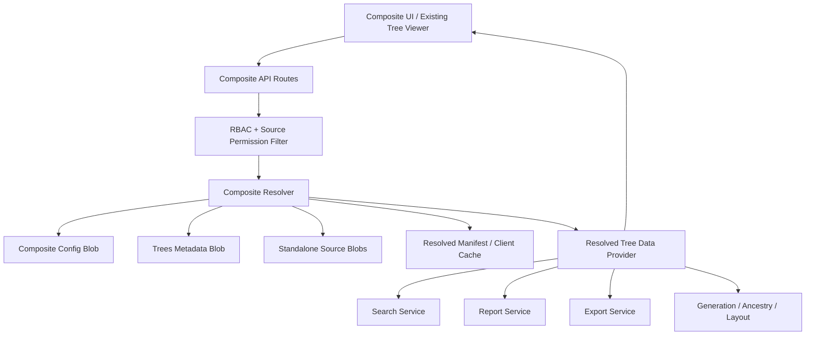

# Design Document: Composite Family Trees (MVP)

## Trạng thái và Phụ thuộc

**SẴN SÀNG TRIỂN KHAI**

Tài liệu này mở rộng `../family-genealogy-management/design.md`. Mọi hành vi
hiện tại của `Standalone_Tree` — data model, chiều canonical của quan hệ, quy
tắc generation, RBAC, backup, PWA và export — vẫn là tham chiếu gốc trừ khi
tài liệu này thêm hành vi composite một cách tường minh.

Các yêu cầu nghiệp vụ chi tiết nằm trong `requirements.md` cùng thư mục.

## Mục tiêu Thiết kế

1. Tổng hợp nhiều `Standalone_Tree` mà không sao chép bản ghi domain.
2. Giữ đúng một nguồn sự thật có thể chỉnh sửa cho mỗi bản ghi nguồn.
3. Liên kết danh tính phải tường minh, có thể hoàn tác và có audit trail.
4. Kiểm tra quyền nguồn tại thời điểm đọc; thành viên composite **không** được
   quyền truy cập nguồn theo kiểu bắc cầu.
5. Trình bày đồ thị đã chuẩn hóa tương thích với toàn bộ tính năng đọc hiện có.
6. Giữ nguyên hành vi và layout lưu trữ hiện tại của tất cả tree hiện có.

## Ngoài Phạm vi

- Tách nhánh (Branch Extraction) và materialization
- Đồng bộ hai chiều giữa các `Source_Tree`
- Sửa `Member`/`Event`/`Media` trực tiếp qua composite
- Tự động xác nhận danh tính
- Nested composites
- Giải quyết conflict theo từng field

Các tính năng trên thuộc `../composite-family-trees-advanced`.

## Key Decisions

### Live projection, not physical merge

A CompositeTree stores references and mapping rules. It never owns copies of
source Member, Relationship, Event or Media records. `CompositeResolver`
materializes an in-memory `ResolvedGraph` for reads and a bounded cache for
performance/offline display.

### Composite-local identity

The same source Member can be equivalent to another source Member in one
composite without becoming globally merged. IdentityGroup is therefore local
to a composite. This keeps the action reversible and prevents one family's
decision from changing other trees.

### Read-only domain projection

All domain mutations continue to target a StandaloneTree. The composite may
mutate only its configuration: sources, scopes, identity groups, cross-tree
relationships and sharing policy.

### Deterministic virtual IDs

Virtual IDs are hashes of stable inputs. They must not depend on array order or
mutable profile fields. This preserves selections, URLs, React keys and cache
entries across repeated resolves.

## Architecture



The main compatibility seam is `TreeDataProvider`. Existing services should
stop assuming every `treeId` maps directly to one `members.json`, while the
standalone provider keeps exactly that behavior.

```typescript
interface TreeDataProvider {
  resolveForUser(treeId: string, userId: string): Promise<ResolvedTreeData>;
}

class StandaloneTreeDataProvider implements TreeDataProvider {}
class CompositeTreeDataProvider implements TreeDataProvider {}
```

## Data Models

### FamilyTree extension

```typescript
export type FamilyTreeKind = 'STANDALONE' | 'COMPOSITE';

export interface FamilyTree {
  id: string;
  kind?: FamilyTreeKind; // missing means STANDALONE for backward compatibility
  name: string;
  description?: string;
  ownerId: string;
  memberships: TreeMembership[];
  createdAt: string;
  updatedAt: string;
}
```

Writers shall always write `kind` for new trees. Readers normalize a missing
value to `STANDALONE` without requiring an eager migration.

### Composite configuration

```typescript
export type CompositeSourceScope =
  | 'FULL_TREE'
  | 'DESCENDANTS'
  | 'SELECTED_MEMBERS';

export type CompositeSourceStatus = 'ACTIVE' | 'UNAVAILABLE';
export type IdentityLinkStatus = 'PROPOSED' | 'CONFIRMED' | 'REJECTED';

export interface SourceReference {
  treeId: string;
  memberId: string;
}

export interface CompositeSource {
  id: string;
  sourceTreeId: string;
  scope: CompositeSourceScope;
  anchorMemberIds: string[];
  selectedMemberIds: string[];
  includeSpouses: boolean;
  includeEvents: boolean;
  includeMedia: boolean;
  allowCompositeSharing: boolean;
  shareLivingDetails: boolean;
  preferredLabel?: string;
  createdAt: string;
  updatedAt: string;
}

export interface CompositeIdentityGroup {
  id: string;
  references: SourceReference[];
  status: IdentityLinkStatus;
  preferredReference?: SourceReference;
  reviewedBy?: string;
  reviewedAt?: string;
  reason?: string;
  createdAt: string;
  updatedAt: string;
}

export interface CompositeRelationship {
  id: string;
  source: SourceReference;
  target: SourceReference;
  type: RelationType;
  customType?: string;
  marriageDate?: string;
  divorceDate?: string;
  marriageStatus?: MarriageStatus;
  createdBy: string;
  createdAt: string;
}

export interface CompositeTreeConfig {
  treeId: string;
  schemaVersion: 1;
  revision: number;
  sources: CompositeSource[];
  identityGroups: CompositeIdentityGroup[];
  crossTreeRelationships: CompositeRelationship[];
  publishedAt?: string;
  createdAt: string;
  updatedAt: string;
}
```

Empty arrays are persisted rather than omitted to simplify validation and
round trips. `revision` is incremented by each successful config mutation.

### Resolved read model

```typescript
export interface SourceProvenance {
  treeId: string;
  entityId: string;
  entityType: 'MEMBER' | 'RELATIONSHIP' | 'EVENT' | 'MEDIA';
  sourceUpdatedAt?: string;
}

export interface VirtualMember extends Omit<Member, 'id' | 'treeId'> {
  id: string;
  treeId: string; // composite tree id
  sourceReferences: SourceReference[];
  preferredReference: SourceReference;
  provenance: SourceProvenance[];
  hasConflictingFields: boolean;
  isPlaceholder?: boolean;
}

export interface VirtualRelationship
  extends Omit<Relationship, 'id' | 'treeId' | 'sourceMemberId' | 'targetMemberId'> {
  id: string;
  treeId: string;
  sourceMemberId: string; // VirtualMember id
  targetMemberId: string; // VirtualMember id
  provenance: SourceProvenance[];
  isCrossTree: boolean;
}

export interface ResolvedSourceManifest {
  sourceTreeId: string;
  status: CompositeSourceStatus;
  version: string;
  resolvedMemberCount: number;
  warningCode?: string;
}

export interface ResolvedTreeData {
  tree: FamilyTree;
  members: VirtualMember[];
  relationships: VirtualRelationship[];
  events: Event[];
  mediaMetadata: MediaMetadata[];
  sourceManifest: ResolvedSourceManifest[];
  warnings: CompositeWarning[];
  resolvedAt: string;
  configRevision: number;
  stale: boolean;
}
```

Events and media returned by the provider need virtual IDs and remapped
`memberIds`; concrete DTO types should be introduced during implementation
rather than casting the source interfaces.

## Storage Layout

```typescript
const BLOB_PATHS = {
  // existing paths remain unchanged
  compositeConfig: (treeId: string) =>
    `data/trees/${treeId}/composite-config.json`,
  compositeChangeLogs: (treeId: string) =>
    `data/trees/${treeId}/composite-change-logs.json`,
  compositeManifest: (treeId: string, audienceHash: string) =>
    `cache/trees/${treeId}/resolved/${audienceHash}.json`,
};
```

Resolved member/event/media payloads are not durable domain data. Server cache
must be treated as disposable and must not be included as the only copy in a
backup. `audienceHash` must encode the viewer's effective source permissions
and privacy policy so one viewer's cache cannot leak to another.

## Composite Resolution Algorithm

### Inputs

- Composite FamilyTree metadata
- CompositeTreeConfig at a specific revision
- Viewer user ID or share-token audience
- Standalone source metadata and source blobs

### Steps

1. Load and schema-validate CompositeTreeConfig.
2. Resolve the viewer's READ permission independently for every source.
3. Load allowed source blobs in parallel with bounded concurrency.
4. Calculate a version token for every source from tree `updatedAt` and relevant
   blob metadata/hash.
5. Apply each source scope:
   - `FULL_TREE`: include all members.
   - `DESCENDANTS`: traverse canonical parent→child edges from every anchor;
     union the reachable sets; optionally add direct spouses as context.
   - `SELECTED_MEMBERS`: include exactly selected members.
6. Keep only relationships whose endpoints are in the scoped member set.
7. Validate confirmed IdentityGroups and construct a union-find index from
   SourceReference to virtual identity.
8. Assign each ungrouped SourceReference its own virtual identity.
9. Select the display record for each identity:
   - use valid `preferredReference` when configured;
   - otherwise use deterministic source order then member ID;
   - never synthesize field values from conflicting sources in MVP.
10. Rewrite source relationships to VirtualMember IDs.
11. Rewrite and add CrossTreeRelationships.
12. Remove self-edges and deduplicate by canonical logical relationship key;
    accumulate provenance on the surviving edge.
13. Remap Event/Media links and deduplicate their member references.
14. Validate referential integrity and parent-child acyclicity.
15. Calculate generations using the existing spouse-component algorithm.
16. Return ResolvedTreeData with warnings, source manifest and resolvedAt.

### Deterministic identifiers

```text
grouped member:   vm_<hash(compositeTreeId + identityGroupId)>
ungrouped member: vm_<hash(compositeTreeId + sourceTreeId + memberId)>
relationship:    vr_<hash(compositeTreeId + canonicalLogicalKey)>
event:           ve_<hash(compositeTreeId + sourceTreeId + eventId)>
media:           vx_<hash(compositeTreeId + sourceTreeId + mediaId)>
```

The hash must use a stable, URL-safe encoding. It is not a security boundary.

### Unavailable sources

For an authenticated in-app viewer, inaccessible sources are omitted. The
resolver may emit an anonymous boundary placeholder only when an allowed
cross-tree relationship would otherwise terminate unexpectedly. A placeholder
contains only a virtual ID, source label such as “Nhánh riêng tư”, and graph
position metadata. It must not expose name, dates, gender, counts or other
personal attributes.

## Services

```typescript
interface CompositeTreeService {
  createCompositeTree(userId: string, input: CreateCompositeTreeInput): Promise<FamilyTree>;
  getConfig(treeId: string): Promise<CompositeTreeConfig>;
  addSource(treeId: string, actorId: string, input: AddSourceInput, revision: number): Promise<CompositeTreeConfig>;
  updateSource(treeId: string, actorId: string, sourceId: string, input: UpdateSourceInput, revision: number): Promise<CompositeTreeConfig>;
  removeSource(treeId: string, actorId: string, sourceId: string, revision: number): Promise<CompositeTreeConfig>;
  previewSource(treeId: string, actorId: string, input: SourceScopeInput): Promise<SourcePreview>;
  upsertIdentityGroup(treeId: string, actorId: string, input: IdentityGroupInput, revision: number): Promise<CompositeTreeConfig>;
  removeIdentityGroup(treeId: string, actorId: string, groupId: string, revision: number): Promise<CompositeTreeConfig>;
  createCrossTreeRelationship(treeId: string, actorId: string, input: CrossTreeRelationshipInput, revision: number): Promise<CompositeTreeConfig>;
  deleteCrossTreeRelationship(treeId: string, actorId: string, relationshipId: string, revision: number): Promise<CompositeTreeConfig>;
  publish(treeId: string, actorId: string, revision: number): Promise<CompositeTreeConfig>;
}

interface CompositeResolver {
  resolveForUser(treeId: string, userId: string): Promise<ResolvedTreeData>;
  resolveForShareToken(treeId: string, token: string): Promise<ResolvedTreeData>;
  validate(treeId: string, config?: CompositeTreeConfig): Promise<CompositeValidationResult>;
}
```

Every config mutation performs compare-and-swap on `revision`. Because the
current Blob layer uses overwrite semantics, the implementation must re-read
the latest config immediately before write and reject a stale expected
revision. If the storage layer cannot provide atomic conditional writes, use a
single mutation document/append log and deterministic fold rather than claim
strong compare-and-swap semantics.

## API Routes

```text
POST   /api/trees                         kind=COMPOSITE
GET    /api/trees/:treeId/composition
GET    /api/trees/:treeId/composition/resolve
POST   /api/trees/:treeId/composition/preview-source
POST   /api/trees/:treeId/composition/sources
PUT    /api/trees/:treeId/composition/sources/:sourceId
DELETE /api/trees/:treeId/composition/sources/:sourceId
GET    /api/trees/:treeId/composition/identity-suggestions
POST   /api/trees/:treeId/composition/identity-groups
PUT    /api/trees/:treeId/composition/identity-groups/:groupId
DELETE /api/trees/:treeId/composition/identity-groups/:groupId
POST   /api/trees/:treeId/composition/relationships
DELETE /api/trees/:treeId/composition/relationships/:relationshipId
POST   /api/trees/:treeId/composition/validate
POST   /api/trees/:treeId/composition/publish
```

Existing read endpoints may keep their URLs but must delegate through
TreeDataProvider. Existing mutation endpoints return `COMPOSITE_READ_ONLY`
before attempting source blob writes.

## Authorization Model

### Configuration administration

- Composite owner/Admin: manage sources, identities, cross-tree relations,
  sharing and publication.
- Composite Editor: read only in MVP unless explicitly expanded later.
- Composite Viewer: read resolved data allowed by source permissions.

### Source data visibility

Effective source access is the intersection of:

1. permission to read the composite;
2. permission to read the source, or source consent for the current composite
   share audience;
3. source scope;
4. field-level privacy/redaction rules.

The resolver performs this check on every online request. Cached payloads do
not bypass it.

### Share links

A source is included in a composite share response only when its
`allowCompositeSharing` flag is true and the actor enabling that flag had
source ADMIN permission. Living-person sensitive fields remain redacted unless
`shareLivingDetails` was consented by a source ADMIN. The UI must show the
exact fields and member counts before enabling sharing.

## UI Design

### Trees list

- Add type badge: “Độc lập” or “Tổng hợp”.
- Add “Tạo gia phả tổng hợp” action.
- Preserve existing default create-tree action as StandaloneTree.

### Composition wizard

1. Name and description
2. Select standalone sources
3. Configure scope and preview for each source
4. Review suggested duplicate people
5. Add or review cross-tree relationships
6. Validate graph
7. Publish

Draft config can be saved between steps. An invalid draft is allowed, but it
cannot be published or used by normal viewer routes.

### Tree viewer

- Reuse current TreeViewer and layout algorithms with ResolvedTreeData.
- Member card includes source badge when requested.
- Member details show preferred source, other matching sources, conflict badge
  and “Open in source tree”.
- Warning panel lists inaccessible sources, stale sources, unresolved identity
  suggestions and invalid links without exposing restricted information.

## Compatibility with Existing Features

| Feature | Standalone behavior | Composite behavior |
|---|---|---|
| Tree viewer | Unchanged | Reads ResolvedGraph |
| Member details | Editable per role | Read-only, links to source |
| Relationships | Canonical source records | Source edges plus cross-tree edges |
| Generation/ancestry | Existing algorithms | Same algorithms after resolve |
| Search/filter | Source members | VirtualMembers with provenance |
| Events/media | Existing CRUD | Read-only remapped records |
| Reports | Existing counts | Deduplicated virtual counts |
| Import/export | Existing formats | Flat snapshot or COMPOSITE_JSON |
| Backup/restore | Existing snapshot | Config + manifest; source backups separate |
| Offline | Existing cache/mutations | Stale-marked read cache; no config writes |

## Error Handling

```typescript
type CompositeErrorCode =
  | 'NOT_COMPOSITE_TREE'
  | 'COMPOSITE_READ_ONLY'
  | 'SOURCE_NOT_FOUND'
  | 'SOURCE_NOT_STANDALONE'
  | 'SOURCE_FORBIDDEN'
  | 'SOURCE_UNAVAILABLE'
  | 'SOURCE_LIMIT_EXCEEDED'
  | 'INVALID_SCOPE'
  | 'REFERENCE_OUT_OF_SCOPE'
  | 'IDENTITY_REFERENCE_CONFLICT'
  | 'DUPLICATE_RELATIONSHIP'
  | 'RELATIONSHIP_CYCLE'
  | 'INVALID_COMPOSITE_CONFIG'
  | 'STALE_CONFIG_REVISION'
  | 'COMPOSITE_NOT_PUBLISHED';
```

- Configuration endpoints return structured field errors without partial
  writes.
- Resolve returns partial data only for source availability failures; invalid
  config and cycle failures block publication.
- Logs must not include living-person private fields or share tokens.

## Correctness Properties

### Property 1: Standalone backward compatibility

For every valid standalone fixture, resolving through TreeDataProvider returns
domain-equivalent members and relationships to the existing readers.

### Property 2: No source mutation

For every composite config operation and resolve, all source blob bytes remain
unchanged.

### Property 3: Scope soundness

Every resolved SourceReference belongs to the configured scope, except a
spouse explicitly included as context.

### Property 4: Confirmed identity uniqueness

Every SourceReference maps to exactly one VirtualMember, and only confirmed
IdentityGroups can map multiple SourceReferences to one VirtualMember.

### Property 5: Deterministic resolution

For identical config revision, source versions and audience permissions,
resolution is invariant to source fetch order and produces stable IDs.

### Property 6: Relationship normalization

The resolved graph contains no self-edge and no duplicate canonical logical
relationship after identity mapping.

### Property 7: Parent-child acyclicity

Every published resolved parent-child graph is a DAG; adding any cross-tree
edge that closes a directed path is rejected.

### Property 8: Permission non-escalation

Adding a user to a CompositeTree never increases that user's readable source
fields unless the user already has source permission or the source has granted
explicit composite-sharing consent.

### Property 9: Reversible identity unlink

Removing a confirmed IdentityGroup restores one virtual node per reference and
preserves all source records and relationships.

### Property 10: Deduplicated reports

Every confirmed identity contributes exactly one person to report totals.

### Property 11: Config concurrency safety

Two updates based on the same revision cannot both silently succeed and erase
each other's changes.

### Property 12: Composite deletion isolation

Deleting a CompositeTree changes no source tree metadata or domain blobs.

## Testing Strategy

### Unit tests

- Zod schemas and backward-compatible `kind` normalization
- Source scope traversal and spouse context
- Deterministic ID generation
- Identity-group validation and display-source selection
- Edge rewriting, deduplication and provenance aggregation
- Cross-tree cycle detection
- Redaction and audience cache-key generation
- Error mapping and stale revision behavior

### Property tests

Use `fast-check` for all twelve correctness properties. Generate multiple
standalone DAGs, arbitrary scopes, overlapping identity groups, permissions and
source fetch orders.

### Integration tests

- Create, configure, preview, validate and publish a composite
- Eight-branch example with one root tree and eight descendant trees
- Permission revocation after cache creation
- Source deletion and partial resolve
- Search/report/export against ResolvedTreeData
- Share-link redaction for living people
- Backup and restore with unavailable sources
- Offline cache marked stale and online reauthorization

### Regression tests

Run the complete original suite. Add contract tests ensuring standalone API
responses and mutation behavior are unchanged.

## Migration and Rollout

1. Deploy readers that normalize missing `FamilyTree.kind` to `STANDALONE`.
2. Introduce data models, blob readers/writers and validation without UI.
3. Introduce TreeDataProvider and route standalone reads through it; run all
   regression tests.
4. Enable composite creation behind `COMPOSITE_TREES_ENABLED`.
5. Add wizard, resolver-based viewer and read feature integrations.
6. Enable composite share links only after privacy/redaction tests pass.
7. Monitor source-read count, resolve latency, cache hit rate and partial
   resolution warnings.

No eager rewrite of existing tree metadata or blobs is required.
