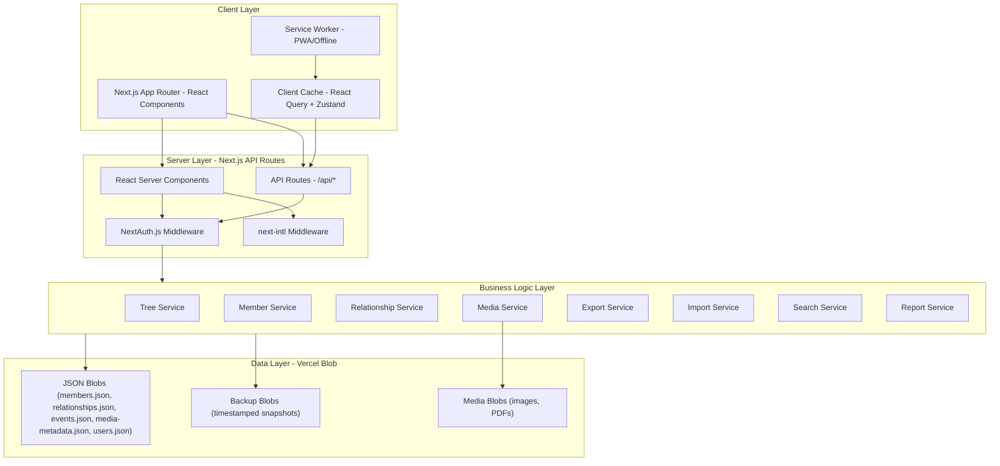
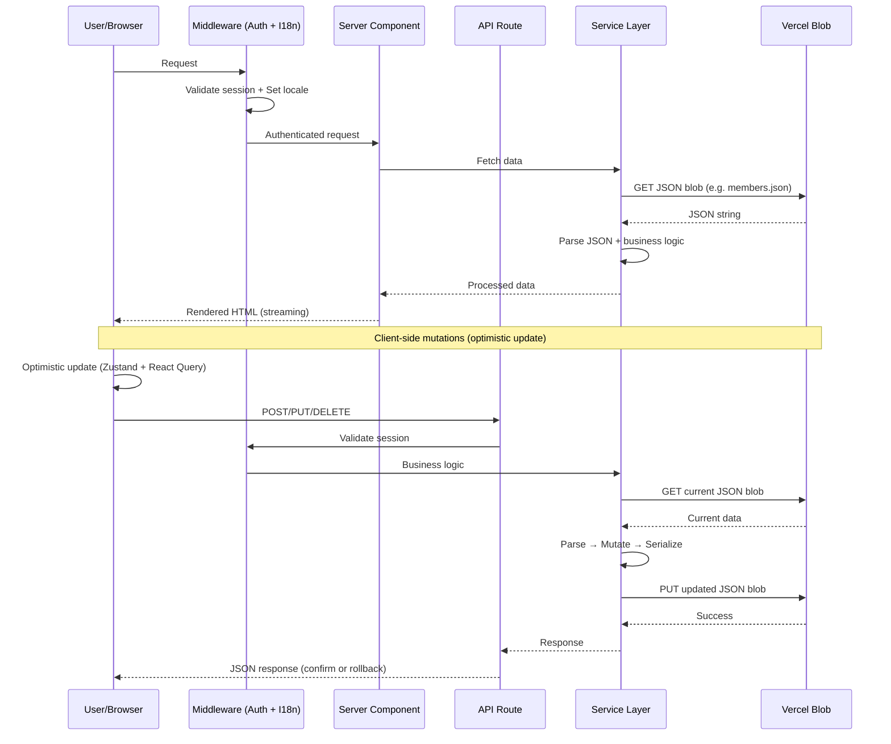
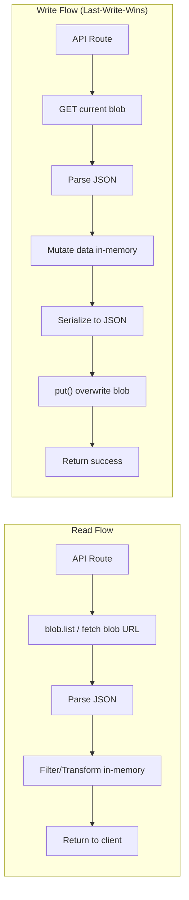
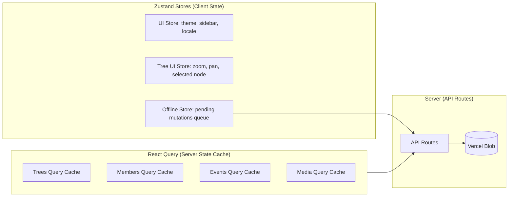
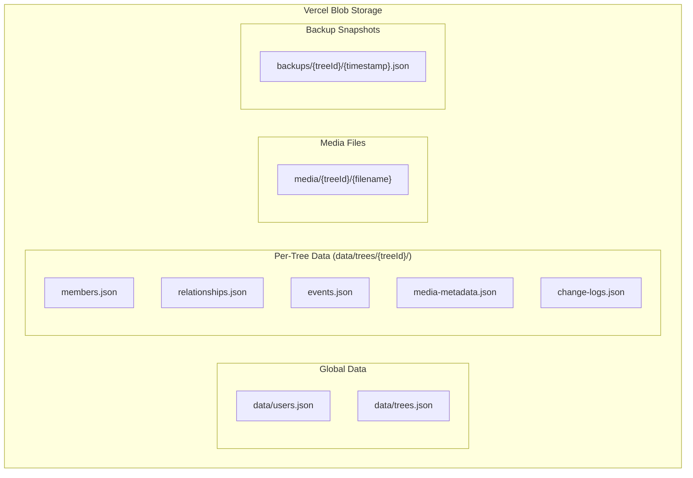

# Design Document: Family Genealogy Management

## Overview

Ứng dụng quản lý gia phả được thiết kế theo kiến trúc Next.js 14+ App Router, kết hợp Server Components và Client Components để tối ưu hiệu năng. Hệ thống sử dụng **Vercel Blob** làm lớp lưu trữ dữ liệu chính (JSON files cho dữ liệu ứng dụng, binary files cho media), NextAuth.js cho authentication, và React Flow cho tree visualization.

Kiến trúc tổng thể tuân theo nguyên tắc:
- **Serverless-first**: API Routes trên Vercel đọc/ghi JSON blobs, không cần database server
- **JSON-as-database**: Toàn bộ dữ liệu ứng dụng lưu dưới dạng JSON files trên Vercel Blob
- **Progressive enhancement**: PWA support với offline capability
- **Type safety**: TypeScript end-to-end từ data interfaces đến UI components
- **Separation of concerns**: Business logic tách biệt khỏi presentation layer

**Deploy target**: Vercel (serverless)
**Storage**: Vercel Blob (free tier: 500MB, 1000 writes/month, 10000 reads/month)

## Architecture

### High-Level System Architecture



### Data Flow Architecture



### Vercel Blob Data Access Pattern



**Concurrency Strategy**: Last-write-wins với client-side optimistic updates. Vì ứng dụng gia phả thường có ít concurrent writers (gia đình), chiến lược này đủ đơn giản và hiệu quả. Client thực hiện optimistic update ngay lập tức, API route đọc→sửa→ghi blob. Nếu write thất bại, client rollback.

### Folder Structure

```
src/
├── app/                          # Next.js App Router
│   ├── [locale]/                 # i18n locale routing
│   │   ├── (auth)/              # Auth layout group
│   │   │   ├── login/
│   │   │   └── register/
│   │   ├── (dashboard)/         # Main app layout group
│   │   │   ├── layout.tsx       # Dashboard layout with sidebar
│   │   │   ├── page.tsx         # Dashboard home
│   │   │   ├── trees/           # Family tree management
│   │   │   │   ├── [treeId]/
│   │   │   │   │   ├── page.tsx         # Tree viewer
│   │   │   │   │   ├── members/
│   │   │   │   │   ├── events/
│   │   │   │   │   ├── media/
│   │   │   │   │   ├── reports/
│   │   │   │   │   └── settings/
│   │   │   │   └── page.tsx     # Trees list
│   │   │   └── settings/        # User settings
│   │   └── layout.tsx           # Root locale layout
│   └── api/                     # API routes
│       ├── auth/[...nextauth]/
│       ├── trees/
│       ├── members/
│       ├── relationships/
│       ├── events/
│       ├── media/
│       ├── search/
│       ├── export/
│       ├── import/
│       └── reports/
├── components/
│   ├── ui/                      # Reusable UI primitives (shadcn/ui)
│   ├── tree/                    # Tree visualization components
│   ├── member/                  # Member-related components
│   ├── media/                   # Media gallery components
│   ├── event/                   # Event/timeline components
│   └── layout/                  # Layout components
├── lib/
│   ├── blob/                    # Vercel Blob access layer
│   │   ├── client.ts            # @vercel/blob SDK wrapper
│   │   ├── readers.ts           # Read helpers (getMembers, getRelationships, etc.)
│   │   └── writers.ts           # Write helpers (putMembers, putRelationships, etc.)
│   ├── services/                # Business logic services
│   ├── validators/              # Zod schemas + validation
│   ├── algorithms/              # Tree algorithms
│   ├── utils/                   # Utility functions
│   └── constants/               # App constants
├── data/                        # TypeScript type definitions for JSON data
│   ├── types.ts                 # Core data interfaces
│   ├── schemas.ts               # Zod validation schemas
│   └── seed.ts                  # Initial data templates
├── hooks/                       # Custom React hooks
├── store/                       # Zustand stores
├── types/                       # General TypeScript type definitions
├── messages/                    # i18n translation files
│   ├── vi.json
│   └── en.json
└── public/
    ├── manifest.json            # PWA manifest
    └── sw.js                    # Service worker
```

## Components and Interfaces

### Vercel Blob Access Layer

Lớp trừu tượng hóa tương tác với Vercel Blob SDK (`@vercel/blob`). Cung cấp typed read/write cho các JSON data blobs.

```typescript
// lib/blob/client.ts
import { put, list, del, head } from '@vercel/blob';

// Blob paths convention
const BLOB_PATHS = {
  users: (treeId?: string) => 'data/users.json',
  trees: () => 'data/trees.json',
  members: (treeId: string) => `data/trees/${treeId}/members.json`,
  relationships: (treeId: string) => `data/trees/${treeId}/relationships.json`,
  events: (treeId: string) => `data/trees/${treeId}/events.json`,
  mediaMetadata: (treeId: string) => `data/trees/${treeId}/media-metadata.json`,
  changeLogs: (treeId: string) => `data/trees/${treeId}/change-logs.json`,
  backup: (treeId: string, timestamp: string) => `backups/${treeId}/${timestamp}.json`,
} as const;

// Generic read/write helpers
async function readBlob<T>(path: string): Promise<T | null> {
  const { blobs } = await list({ prefix: path });
  if (blobs.length === 0) return null;
  const response = await fetch(blobs[0].url);
  return response.json() as Promise<T>;
}

async function writeBlob<T>(path: string, data: T): Promise<void> {
  const json = JSON.stringify(data, null, 2);
  await put(path, json, { access: 'public', addRandomSuffix: false });
}
```

```typescript
// lib/blob/readers.ts
import { readBlob } from './client';
import type { Member, Relationship, Event, MediaMetadata } from '@/data/types';

export async function getMembers(treeId: string): Promise<Member[]> {
  return (await readBlob<Member[]>(BLOB_PATHS.members(treeId))) ?? [];
}

export async function getRelationships(treeId: string): Promise<Relationship[]> {
  return (await readBlob<Relationship[]>(BLOB_PATHS.relationships(treeId))) ?? [];
}

export async function getEvents(treeId: string): Promise<Event[]> {
  return (await readBlob<Event[]>(BLOB_PATHS.events(treeId))) ?? [];
}

export async function getMediaMetadata(treeId: string): Promise<MediaMetadata[]> {
  return (await readBlob<MediaMetadata[]>(BLOB_PATHS.mediaMetadata(treeId))) ?? [];
}
```

```typescript
// lib/blob/writers.ts
import { writeBlob } from './client';
import type { Member, Relationship, Event, MediaMetadata } from '@/data/types';

export async function putMembers(treeId: string, members: Member[]): Promise<void> {
  await writeBlob(BLOB_PATHS.members(treeId), members);
}

export async function putRelationships(treeId: string, relationships: Relationship[]): Promise<void> {
  await writeBlob(BLOB_PATHS.relationships(treeId), relationships);
}

export async function putEvents(treeId: string, events: Event[]): Promise<void> {
  await writeBlob(BLOB_PATHS.events(treeId), events);
}

export async function putMediaMetadata(treeId: string, metadata: MediaMetadata[]): Promise<void> {
  await writeBlob(BLOB_PATHS.mediaMetadata(treeId), metadata);
}
```

### Core Services

#### TreeService
Quản lý CRUD cho Family Tree. Đọc/ghi dữ liệu từ `trees.json` blob.

```typescript
interface TreeService {
  createTree(userId: string, data: CreateTreeInput): Promise<FamilyTree>;
  getTree(treeId: string): Promise<FamilyTree>;
  deleteTree(treeId: string): Promise<void>;
  getTreeWithMembers(treeId: string): Promise<FamilyTreeFull>;
  calculateGenerations(treeId: string): Promise<GenerationMap>;
  getAncestryPath(memberId: string, treeId: string): Promise<Member[]>;
}
```

#### MemberService
Quản lý thành viên gia phả. Đọc/ghi từ `members.json` blob per tree.

```typescript
interface MemberService {
  createMember(treeId: string, data: CreateMemberInput): Promise<Member>;
  updateMember(treeId: string, memberId: string, data: UpdateMemberInput): Promise<Member>;
  deleteMember(treeId: string, memberId: string): Promise<DeleteMemberResult>;
  getMemberWithRelations(treeId: string, memberId: string): Promise<MemberFull>;
  findDuplicates(treeId: string, criteria: DuplicateSearchCriteria): Promise<MemberPair[]>;
  mergeMember(treeId: string, sourceId: string, targetId: string, strategy: MergeStrategy): Promise<Member>;
}
```

#### RelationshipService
Quản lý mối quan hệ giữa các thành viên. Đọc/ghi quan hệ chuẩn từ
`relationships.json` blob và materialize góc nhìn theo từng Member ở service
boundary.

```typescript
type RelationshipRole = 'PARENT' | 'CHILD' | 'SPOUSE' | 'SIBLING' | 'ADOPTED' | 'CUSTOM';

interface RelationshipView {
  relationshipId: string;
  memberId: string;
  relatedMemberId: string;
  type: RelationType;
  role: RelationshipRole;
  customType?: string;
  marriageDate?: string;
  divorceDate?: string;
  marriageStatus?: MarriageStatus;
}

interface RelationshipService {
  createRelationship(treeId: string, data: CreateRelationshipInput): Promise<Relationship>;
  deleteRelationship(treeId: string, relationshipId: string): Promise<void>;
  validateRelationship(treeId: string, data: CreateRelationshipInput): Promise<ValidationResult>;
  getRelationshipsForMember(treeId: string, memberId: string): Promise<RelationshipView[]>;
  detectCycles(treeId: string, proposedRelation: CreateRelationshipInput): Promise<boolean>;
  getInverseRelationType(type: RelationType): RelationType;
}
```

#### SearchService
Tìm kiếm in-memory trên parsed JSON data. Hỗ trợ tiếng Việt có/không dấu.

```typescript
interface SearchService {
  search(treeId: string, query: string, options?: SearchOptions): Promise<SearchResult[]>;
  autocomplete(treeId: string, prefix: string): Promise<AutocompleteItem[]>;
  filterMembers(treeId: string, filters: MemberFilters): Promise<Member[]>;
}
```

**Design Decision**: Search được thực hiện in-memory sau khi đọc toàn bộ `members.json` blob. Với gia phả dưới 1000 members (typical), JSON parse + in-memory filter đủ nhanh (< 100ms). Không cần full-text search engine.

#### MediaService
Quản lý upload/download media files trực tiếp lên Vercel Blob.

```typescript
interface MediaService {
  uploadMedia(treeId: string, file: File, metadata: MediaUploadInput): Promise<MediaMetadata>;
  deleteMedia(treeId: string, mediaId: string): Promise<void>;
  getMediaForMember(treeId: string, memberId: string): Promise<MediaMetadata[]>;
  getMediaForEvent(treeId: string, eventId: string): Promise<MediaMetadata[]>;
  generateThumbnailUrl(blobUrl: string, width: number): string;
}
```

#### ImportService / ExportService

```typescript
interface ImportService {
  parseGEDCOM(file: Buffer): Promise<ParsedGEDCOM>;
  parseJSON(file: Buffer): Promise<ParsedJSON>;
  parseCSV(file: Buffer): Promise<ParsedCSV>;
  preview(parsed: ParsedData): Promise<ImportPreview>;
  execute(treeId: string, parsed: ParsedData, options: ImportOptions): Promise<ImportResult>;
}

interface ExportService {
  exportGEDCOM(treeId: string): Promise<Buffer>;
  exportJSON(treeId: string): Promise<string>;
  exportPDF(treeId: string, options: PDFOptions): Promise<Buffer>;
  exportImage(treeId: string, options: ImageOptions): Promise<Buffer>;
  exportSVG(treeId: string, options: SVGOptions): Promise<string>;
}
```

### Key UI Components

#### TreeViewer Component
Component chính cho trực quan hóa cây gia phả, sử dụng React Flow.

```typescript
interface TreeViewerProps {
  treeId: string;
  mode: 'vertical' | 'horizontal' | 'fan';
  selectedMemberId?: string;
  onMemberSelect: (memberId: string) => void;
  onMemberDoubleClick: (memberId: string) => void;
  highlightPath?: string[];  // ancestry path highlighting
}
```

#### MemberCard Component
Hiển thị thông tin tóm tắt member trên tree node.

```typescript
interface MemberCardProps {
  member: MemberSummary;
  isSelected: boolean;
  isHighlighted: boolean;
  displayMode: 'compact' | 'detailed';
  colorScheme: ColorScheme; // based on gender/generation/status
}
```

### State Management Architecture



**Design Decision:** Sử dụng Zustand cho UI state (theme, sidebar toggle, tree zoom/pan, offline queue) và React Query cho server state (members, trees, events). Lý do:
- React Query tự động quản lý cache invalidation, refetching, và optimistic updates
- Zustand nhẹ, không boilerplate, phù hợp cho transient UI state
- Offline queue trong Zustand giữ các mutations pending khi mất kết nối, tự động replay khi online

### API Routes Structure

| Method | Route | Description | Blob Access |
|--------|-------|-------------|-------------|
| POST | `/api/auth/[...nextauth]` | NextAuth.js handlers | users.json |
| GET/POST | `/api/trees` | List / Create trees | trees.json |
| GET/PUT/DELETE | `/api/trees/[treeId]` | CRUD single tree | trees.json |
| GET/POST | `/api/trees/[treeId]/members` | List / Create members | members.json |
| GET/PUT/DELETE | `/api/members/[memberId]` | CRUD single member | members.json |
| POST | `/api/trees/[treeId]/relationships` | Create relationship | relationships.json |
| DELETE | `/api/relationships/[relationshipId]` | Delete relationship | relationships.json |
| POST | `/api/relationships/validate` | Validate before create | relationships.json + members.json |
| GET/POST | `/api/trees/[treeId]/events` | List / Create events | events.json |
| GET/PUT/DELETE | `/api/events/[eventId]` | CRUD single event | events.json |
| POST | `/api/media/upload` | Upload media file | Vercel Blob (binary) + media-metadata.json |
| GET | `/api/trees/[treeId]/media` | List media for tree | media-metadata.json |
| GET | `/api/search?q=&treeId=` | In-memory search | members.json |
| POST | `/api/import/preview` | Preview import data | — |
| POST | `/api/import/execute` | Execute import | All relevant blobs |
| GET | `/api/export/[treeId]/[format]` | Export tree | All tree blobs |
| GET | `/api/reports/[treeId]/statistics` | Get statistics | members.json + relationships.json |
| POST | `/api/backup/[treeId]` | Create backup snapshot | All → backup blob |

#### Example API Route Pattern (Read → Mutate → Write)

```typescript
// app/api/trees/[treeId]/members/route.ts
import { NextResponse } from 'next/server';
import { getMembers, putMembers } from '@/lib/blob/writers';
import { createMemberSchema } from '@/data/schemas';
import { nanoid } from 'nanoid';

export async function GET(req: Request, { params }: { params: { treeId: string } }) {
  const members = await getMembers(params.treeId);
  return NextResponse.json(members);
}

export async function POST(req: Request, { params }: { params: { treeId: string } }) {
  const body = await req.json();
  const validated = createMemberSchema.parse(body);

  // Read current members
  const members = await getMembers(params.treeId);

  // Create new member
  const newMember = {
    id: nanoid(),
    treeId: params.treeId,
    ...validated,
    createdAt: new Date().toISOString(),
    updatedAt: new Date().toISOString(),
  };

  // Write back with new member appended
  members.push(newMember);
  await putMembers(params.treeId, members);

  return NextResponse.json(newMember, { status: 201 });
}
```

## Data Models

### JSON Data Structure on Vercel Blob

Dữ liệu được tổ chức thành các JSON files riêng biệt trên Vercel Blob, mỗi file chứa một mảng objects. Không sử dụng database hay ORM.



### TypeScript Interfaces (data/types.ts)

```typescript
// ===== User & Auth =====
interface User {
  id: string;
  email: string;
  name: string;
  passwordHash: string;
  image?: string;
  provider: 'credentials' | 'google' | 'facebook';
  failedLoginAttempts: number;
  lockedUntil?: string; // ISO date
  createdAt: string;
  updatedAt: string;
}

interface Session {
  userId: string;
  token: string;
  expiresAt: string;
}

// ===== Family Tree =====
interface FamilyTree {
  id: string;
  name: string;
  description?: string;
  ownerId: string;
  memberships: TreeMembership[];
  createdAt: string;
  updatedAt: string;
}

interface TreeMembership {
  userId: string;
  role: 'ADMIN' | 'EDITOR' | 'VIEWER';
  createdAt: string;
}

// ===== Member =====
interface Member {
  id: string;
  treeId: string;
  firstName: string;
  lastName: string;
  fullName: string;
  nickname?: string;
  gender: 'MALE' | 'FEMALE' | 'OTHER';
  dateOfBirth?: string; // ISO date
  dateOfDeath?: string; // ISO date
  placeOfBirth?: string;
  currentAddress?: string;
  phone?: string;
  email?: string;
  occupation?: string;
  education?: string;
  biography?: string;
  achievements?: string;
  notes?: string;
  avatarUrl?: string;
  generation?: number;
  isAlive: boolean;
  createdAt: string;
  updatedAt: string;
}

// ===== Relationship =====
type RelationType = 'PARENT_CHILD' | 'SPOUSE' | 'SIBLING' | 'ADOPTED' | 'CUSTOM';
type MarriageStatus = 'MARRIED' | 'DIVORCED' | 'WIDOWED';

interface Relationship {
  id: string;
  treeId: string;
  // One logical relationship is persisted exactly once.
  // For PARENT_CHILD/ADOPTED: source is parent, target is child.
  // For SPOUSE/SIBLING: the endpoints are symmetric and their inverse view
  // is materialized at the service/API boundary, not persisted as a second row.
  sourceMemberId: string;
  targetMemberId: string;
  type: RelationType;
  customType?: string;
  marriageDate?: string;
  divorceDate?: string;
  marriageStatus?: MarriageStatus;
  createdAt: string;
}

`relationships.json` của các cây đã tồn tại có thể chứa cặp bản ghi đảo chiều do
phiên bản cũ. Migration phải giữ lại một bản ghi canonical theo quy tắc
`source=parent, target=child` cho PARENT_CHILD/ADOPTED, chuẩn hóa các quan hệ
đối xứng theo một thứ tự ổn định, và ghi change log cho số bản ghi đã hợp nhất.
Trong thời gian migration, reader có thể đọc dữ liệu cũ ở chế độ tương thích
nhưng không được tạo thêm bản ghi đảo chiều mới.

// ===== Event =====
type EventType = 'BIRTHDAY' | 'WEDDING' | 'FUNERAL' | 'REUNION' | 'ANNIVERSARY' | 'CUSTOM';

interface Event {
  id: string;
  treeId: string;
  type: EventType;
  customType?: string;
  title: string;
  eventDate: string;
  location?: string;
  description?: string;
  memberIds: string[]; // Members participating
  mediaIds: string[];  // Attached media
  createdAt: string;
  updatedAt: string;
}

// ===== Media =====
interface MediaMetadata {
  id: string;
  treeId: string;
  memberId?: string;
  eventId?: string;
  albumId?: string;
  filename: string;
  originalName: string;
  mimeType: string;
  fileSize: number;
  blobUrl: string;       // Vercel Blob URL for original
  thumbnailUrl?: string; // Vercel Blob URL for thumbnail
  caption?: string;
  takenAt?: string;
  uploadedAt: string;
}

interface Album {
  id: string;
  treeId: string;
  title: string;
  description?: string;
  createdAt: string;
}

// ===== Change Log =====
interface ChangeLog {
  id: string;
  treeId: string;
  memberId?: string;
  userId: string;
  action: 'CREATE' | 'UPDATE' | 'DELETE';
  entityType: 'MEMBER' | 'RELATIONSHIP' | 'EVENT' | 'MEDIA';
  previousData?: Record<string, unknown>;
  newData?: Record<string, unknown>;
  fieldChanged?: string;
  createdAt: string;
}

// ===== Share Link =====
interface ShareLink {
  id: string;
  treeId: string;
  token: string;
  permission: 'VIEW';
  expiresAt: string;
  createdAt: string;
}

// ===== Backup =====
interface BackupSnapshot {
  treeId: string;
  timestamp: string;
  data: {
    members: Member[];
    relationships: Relationship[];
    events: Event[];
    mediaMetadata: MediaMetadata[];
  };
}
```

### Zod Validation Schemas (data/schemas.ts)

```typescript
import { z } from 'zod';

export const createMemberSchema = z.object({
  firstName: z.string().min(1).max(100),
  lastName: z.string().min(1).max(100),
  fullName: z.string().min(1).max(200),
  nickname: z.string().max(100).optional(),
  gender: z.enum(['MALE', 'FEMALE', 'OTHER']),
  dateOfBirth: z.string().datetime().optional(),
  dateOfDeath: z.string().datetime().optional(),
  placeOfBirth: z.string().max(200).optional(),
  currentAddress: z.string().max(500).optional(),
  phone: z.string().max(20).optional(),
  email: z.string().email().optional(),
  occupation: z.string().max(200).optional(),
  education: z.string().max(200).optional(),
  biography: z.string().max(5000).optional(),
  achievements: z.string().max(2000).optional(),
  notes: z.string().max(2000).optional(),
  isAlive: z.boolean().default(true),
});

export const createRelationshipSchema = z.object({
  sourceMemberId: z.string().min(1),
  targetMemberId: z.string().min(1),
  type: z.enum(['PARENT_CHILD', 'SPOUSE', 'SIBLING', 'ADOPTED', 'CUSTOM']),
  customType: z.string().max(100).optional(),
  marriageDate: z.string().datetime().optional(),
  divorceDate: z.string().datetime().optional(),
  marriageStatus: z.enum(['MARRIED', 'DIVORCED', 'WIDOWED']).optional(),
});

export const createEventSchema = z.object({
  type: z.enum(['BIRTHDAY', 'WEDDING', 'FUNERAL', 'REUNION', 'ANNIVERSARY', 'CUSTOM']),
  customType: z.string().max(100).optional(),
  title: z.string().min(1).max(200),
  eventDate: z.string().min(1),
  location: z.string().max(300).optional(),
  description: z.string().max(2000).optional(),
  memberIds: z.array(z.string()).default([]),
});
```

### Key Algorithms

#### 1. Generation Calculation Algorithm

Thuật toán tính đời (generation) in-memory từ các quan hệ chuẩn. Trước khi
duyệt quan hệ cha/mẹ-con, thuật toán gom các thành viên nối với nhau bằng quan
hệ vợ-chồng thành một spouse component. Mỗi component là một node trong đồ thị
đời, nhờ đó một người chưa khai báo cha/mẹ nhưng đã có vợ/chồng không bị coi là
một root độc lập.

```typescript
function calculateGenerations(
  members: Member[],
  relationships: Relationship[]
): Map<string, number> {
  const spouseComponents = unionFind(
    members.map(member => member.id),
    relationships.filter(rel => rel.type === 'SPOUSE')
  );
  const componentGraph = buildComponentGraph(
    spouseComponents,
    relationships.filter(rel => rel.type === 'PARENT_CHILD')
  );

  // Validation rejects self-component edges, ancestry cycles and conflicting
  // generation constraints before this calculation is invoked.
  const componentGeneration = topologicalGenerations(componentGraph, {
    rootGeneration: 0,
    childOffset: 1
  });

  return new Map(members.map(member => [
    member.id,
    componentGeneration.get(spouseComponents.componentOf(member.id)) ?? 0
  ]));
}
```

Quy tắc của đồ thị component:

- Một Relationship `PARENT_CHILD` được lưu đúng một lần theo chiều parent→child.
- Các spouse component không nhận cạnh parent→child là component gốc và có generation 0.
- Tất cả Member trong cùng spouse component có cùng generation.
- Component con có generation bằng component cha/mẹ cộng một.
- Nhiều cha/mẹ cùng trỏ tới một component con là hợp lệ nếu các ràng buộc đời nhất quán.
- Thành viên hoặc nhánh tách rời bắt đầu ở generation 0 trong component riêng của nhánh đó.

#### 2. Relationship Cycle Detection

```typescript
function detectCycles(
  relationships: Relationship[],
  proposedSource: string,
  proposedTarget: string
): boolean {
  // Self-reference check
  if (proposedSource === proposedTarget) return true;

  // Build parent→child adjacency from canonical PARENT_CHILD relationships.
  // There are no persisted child→parent duplicates.
  const parentToChildren = new Map<string, Set<string>>();
  for (const rel of relationships.filter(r => r.type === 'PARENT_CHILD')) {
    const children = parentToChildren.get(rel.sourceMemberId) ?? new Set();
    children.add(rel.targetMemberId);
    parentToChildren.set(rel.sourceMemberId, children);
  }

  // Adding source(parent) → target(child) is cyclic exactly when source is
  // already reachable from target through parent→child edges.
  return isReachable(parentToChildren, proposedTarget, proposedSource);
}
```

Việc hai cha/mẹ cùng trỏ tới một người con tạo hình hội tụ (diamond) chứ không
phải chu trình. Cycle detection chỉ duyệt theo chiều parent→child chuẩn và không
được diễn giải quan hệ vợ-chồng hoặc cách nhìn ngược child→parent như cạnh tổ tiên.

#### 3. Vietnamese Fuzzy Search (In-Memory)

```typescript
function normalizeVietnamese(str: string): string {
  return str
    .normalize('NFD')
    .replace(/[\u0300-\u036f]/g, '')
    .replace(/đ/g, 'd')
    .replace(/Đ/g, 'D')
    .toLowerCase()
    .trim();
}

function searchMembers(members: Member[], query: string): Member[] {
  const normalizedQuery = normalizeVietnamese(query);

  return members.filter(member => {
    const searchFields = [
      member.fullName,
      member.nickname,
      member.occupation,
      member.placeOfBirth,
      member.currentAddress,
    ].filter(Boolean) as string[];

    return searchFields.some(field => {
      // Check both normalized (diacritics-insensitive) and original
      if (normalizeVietnamese(field).includes(normalizedQuery)) return true;
      if (field.toLowerCase().includes(query.toLowerCase())) return true;
      return false;
    });
  });
}
```

#### 4. GEDCOM Parser

```typescript
interface GEDCOMRecord {
  level: number;
  tag: string;
  value?: string;
  children: GEDCOMRecord[];
}

function parseGEDCOM(content: string): ParsedGEDCOM {
  const lines = content.split('\n');
  const records: GEDCOMRecord[] = [];
  const stack: GEDCOMRecord[] = [];

  for (const line of lines) {
    const match = line.match(/^(\d+)\s+(@\w+@\s+)?(\w+)\s*(.*)?$/);
    if (!match) continue;

    const [, levelStr, id, tag, value] = match;
    const level = parseInt(levelStr);
    const record: GEDCOMRecord = { level, tag, value: value?.trim(), children: [] };

    while (stack.length > level) stack.pop();
    if (stack.length > 0) {
      stack[stack.length - 1].children.push(record);
    } else {
      records.push(record);
    }
    stack.push(record);
  }

  return convertToFamilyTree(records);
}
```

## Correctness Properties

*A property is a characteristic or behavior that should hold true across all valid executions of a system — essentially, a formal statement about what the system should do. Properties serve as the bridge between human-readable specifications and machine-verifiable correctness guarantees.*

### Property 1: Account Lockout Threshold

*For any* user account and any sequence of failed login attempts, the account SHALL be locked if and only if the number of consecutive failed attempts is >= 5, and locked accounts SHALL reject valid credentials until the lockout period (15 minutes) expires.

**Validates: Requirements 1.4**

### Property 2: Role-Based Permission Enforcement

*For any* user with a given role (ADMIN, EDITOR, VIEWER) and any operation, the system SHALL permit the operation if and only if the role has the required permission level (ADMIN: all operations, EDITOR: read + write, VIEWER: read only).

**Validates: Requirements 1.5**

### Property 3: Member Data Preservation Round-Trip

*For any* valid member data, creating a member via the API and then reading it back SHALL produce an object containing all the original field values unchanged.

**Validates: Requirements 2.1**

### Property 4: Change Log Completeness

*For any* member update operation, the change log SHALL contain an entry recording the previous value, new value, field changed, user who performed the change, and timestamp.

**Validates: Requirements 2.2**

### Property 5: Lifespan Calculation Correctness

*For any* member with both dateOfBirth and dateOfDeath set, the computed lifespan SHALL equal the difference between dateOfDeath and dateOfBirth in years (accounting for whether birthday has occurred in death year).

**Validates: Requirements 2.5**

### Property 6: Derived Inverse Relationship Symmetry

*For any* canonical relationship created between member A and member B with type T, the persistence layer SHALL contain exactly one logical record and the read model SHALL expose the corresponding inverse semantic view (e.g., A is parent of B is viewed from B as child of A). Deleting the logical relationship SHALL remove both views.

**Validates: Requirements 3.2**

### Property 7: Cycle Detection Correctness

*For any* proposed canonical PARENT_CHILD relationship `source(parent) → target(child)`, validation SHALL reject it exactly when `source` is reachable from `target` through existing canonical parent→child edges (or source equals target). Multiple parents converging on the same child SHALL be accepted when no directed cycle is created.

**Validates: Requirements 3.3**

### Property 8: Generation Calculation Invariants

*For any* valid family tree, after collapsing spouse-connected members into components, the generation assignment SHALL satisfy: (a) components with no incoming parent-child edge have generation 0, (b) for every canonical parent-child relationship, childComponent.generation = parentComponent.generation + 1, and (c) every pair of spouses has the same generation. A spouse without recorded parents SHALL inherit the connected spouse component's generation rather than becoming an independent root.

**Validates: Requirements 3.5**

### Property 9: Ancestry Path Validity

*For any* member in a family tree, the ancestry path from root to that member SHALL be a valid sequence where each consecutive pair has a parent-child relationship, starting from a root ancestor (generation 0) and ending at the target member.

**Validates: Requirements 4.6**

### Property 10: Search Correctness with Vietnamese Normalization

*For any* search query (with or without Vietnamese diacritics) and any set of members, all returned results SHALL contain the query string (after normalization) in at least one searchable field (fullName, nickname, occupation, placeOfBirth), and no member matching the query SHALL be excluded from results.

**Validates: Requirements 6.1, 6.2**

### Property 11: Filter Returns Only Matching Members

*For any* combination of filter criteria (gender, generation, birth year range, alive status, location) and any members dataset, every returned member SHALL satisfy ALL applied filter conditions, and no member satisfying all conditions SHALL be excluded.

**Validates: Requirements 6.3**

### Property 12: JSON Export/Import Round-Trip

*For any* valid FamilyTree object (with members, relationships, events, media metadata), exporting to JSON and then importing the resulting JSON SHALL produce a FamilyTree equivalent to the original (same members, relationships, events with identical field values).

**Validates: Requirements 9.5**

### Property 13: Invalid Import Error Reporting

*For any* input file with syntax errors or invalid data (malformed JSON, missing required fields, invalid relationship references), the import service SHALL produce an error report identifying the specific issues rather than silently accepting or crashing.

**Validates: Requirements 9.6**

### Property 14: Backup/Restore Round-Trip

*For any* family tree state, creating a backup snapshot and then restoring from that snapshot SHALL produce a tree state equivalent to the original (all members, relationships, events, and media metadata preserved).

**Validates: Requirements 16.7**

## Error Handling

### Error Strategy by Layer

| Layer | Error Type | Handling |
|-------|-----------|----------|
| Client | Network failure | Optimistic update rollback + queue for retry |
| Client | Validation error | Zod schema validation before API call, inline error messages |
| API Route | Auth failure | 401/403 response, redirect to login |
| API Route | Validation error | 400 response with Zod error details |
| API Route | Blob read failure | 500 response, log error, show user-friendly message |
| API Route | Blob write failure | 500 response, client keeps pending mutation for retry |
| Service | Cycle detection | Return validation error with explanation |
| Service | Duplicate member | Return suggestions, don't auto-merge |
| Blob | Rate limit (429) | Exponential backoff retry (max 3 attempts) |
| Blob | Storage full | Alert user, suggest cleanup or upgrade |

### Vercel Blob Specific Error Handling

```typescript
// lib/blob/client.ts - Error handling wrapper
import { BlobAccessError } from '@vercel/blob';

export class BlobStorageError extends Error {
  constructor(
    message: string,
    public readonly code: 'NETWORK' | 'RATE_LIMIT' | 'STORAGE_FULL' | 'NOT_FOUND' | 'UNKNOWN',
    public readonly retryable: boolean
  ) {
    super(message);
  }
}

async function withBlobErrorHandling<T>(operation: () => Promise<T>): Promise<T> {
  try {
    return await operation();
  } catch (error) {
    if (error instanceof BlobAccessError) {
      if (error.message.includes('rate limit')) {
        throw new BlobStorageError('Rate limit exceeded', 'RATE_LIMIT', true);
      }
      if (error.message.includes('storage')) {
        throw new BlobStorageError('Storage quota exceeded', 'STORAGE_FULL', false);
      }
    }
    if (error instanceof TypeError && error.message.includes('fetch')) {
      throw new BlobStorageError('Network error', 'NETWORK', true);
    }
    throw new BlobStorageError('Unknown storage error', 'UNKNOWN', true);
  }
}
```

### Client-Side Optimistic Update Pattern

```typescript
// hooks/useMemberMutation.ts
function useMemberMutation(treeId: string) {
  const queryClient = useQueryClient();

  return useMutation({
    mutationFn: (data: CreateMemberInput) => api.createMember(treeId, data),
    onMutate: async (newMember) => {
      // Cancel outgoing refetches
      await queryClient.cancelQueries({ queryKey: ['members', treeId] });
      // Snapshot previous value
      const previous = queryClient.getQueryData(['members', treeId]);
      // Optimistic update
      queryClient.setQueryData(['members', treeId], (old: Member[]) => [
        ...old,
        { ...newMember, id: 'temp-' + Date.now(), createdAt: new Date().toISOString() },
      ]);
      return { previous };
    },
    onError: (err, newMember, context) => {
      // Rollback on error
      queryClient.setQueryData(['members', treeId], context?.previous);
      // Add to retry queue if retryable
      if (err instanceof BlobStorageError && err.retryable) {
        offlineStore.addPendingMutation({ type: 'CREATE_MEMBER', treeId, data: newMember });
      }
    },
    onSettled: () => {
      queryClient.invalidateQueries({ queryKey: ['members', treeId] });
    },
  });
}
```

## Testing Strategy

### Dual Testing Approach

Kết hợp unit tests (example-based) và property-based tests để đảm bảo correctness toàn diện.

### Unit Tests (Example-Based)

Framework: **Vitest** (tương thích tốt với Next.js, nhanh, native ESM support)

Phạm vi unit tests:
- **API route handlers**: Test request/response với mock blob storage
- **Zod validation schemas**: Test valid/invalid inputs với specific examples
- **UI components**: React Testing Library cho component behavior
- **Auth flows**: Specific login/logout/role-assignment scenarios
- **Event CRUD**: Specific creation/update/delete scenarios
- **Media upload**: Mock blob upload, verify metadata storage

### Property-Based Tests

Framework: **fast-check** (JavaScript PBT library, tích hợp tốt với Vitest)

Configuration:
- Minimum **100 iterations** per property test
- Each property test references its design document property
- Tag format: **Feature: family-genealogy-management, Property {number}: {property_text}**

Property tests cover:
1. **Algorithms**: Generation calculation, cycle detection, ancestry path, search/filter
2. **Data integrity**: Round-trip properties (member CRUD, JSON export/import, backup/restore)
3. **Business rules**: Role permissions, account lockout, relationship validation
4. **Error handling**: Invalid import error reporting

### Test Organization

```
tests/
├── unit/
│   ├── api/              # API route handler tests
│   ├── components/       # React component tests
│   ├── services/         # Service logic tests
│   └── validators/       # Zod schema tests
├── property/
│   ├── algorithms/       # Tree algorithms (generation, cycles, ancestry)
│   ├── search/           # Search and filter properties
│   ├── data-integrity/   # Round-trip, change-log properties
│   └── auth/             # Lockout, permissions properties
├── integration/
│   ├── blob/             # Real Vercel Blob integration
│   └── auth/             # NextAuth.js flow tests
└── e2e/
    └── cypress/          # End-to-end UI tests
```

### Property Test Implementation Example

```typescript
// tests/property/algorithms/generation.test.ts
import { describe, it } from 'vitest';
import * as fc from 'fast-check';
import { calculateGenerations } from '@/lib/algorithms/generation';

describe('Feature: family-genealogy-management, Property 8: Generation Calculation Invariants', () => {
  it('spouse components share a generation and children are one level below parents', () => {
    fc.assert(
      fc.property(
        arbitraryFamilyTree(), // custom arbitrary for valid tree
        (tree) => {
          const { members, relationships } = tree;
          const generations = calculateGenerations(members, relationships);

          // Canonical parent → child edges advance one generation.
          for (const rel of relationships.filter(r => r.type === 'PARENT_CHILD')) {
            const parentGen = generations.get(rel.sourceMemberId);
            const childGen = generations.get(rel.targetMemberId);
            if (parentGen !== undefined && childGen !== undefined) {
              expect(childGen).toBe(parentGen + 1);
            }
          }

          // A spouse without recorded parents inherits the spouse component's
          // generation; they are not seeded as an independent root.
          for (const rel of relationships.filter(r => r.type === 'SPOUSE')) {
            const gen1 = generations.get(rel.sourceMemberId);
            const gen2 = generations.get(rel.targetMemberId);
            if (gen1 !== undefined && gen2 !== undefined) {
              expect(gen1).toBe(gen2);
            }
          }
        }
      ),
      { numRuns: 100 }
    );
  });
});
```

### Key Technical Decisions

| Decision | Choice | Rationale |
|----------|--------|-----------|
| Storage | Vercel Blob (JSON files) | No database needed, fits free tier, simple serverless deployment |
| Concurrency | Last-write-wins | Family apps have few concurrent writers, simplicity over complexity |
| Search | In-memory on parsed JSON | < 1000 members typical, parse + filter is fast enough |
| Auth storage | users.json blob | Avoids database dependency for auth, works with NextAuth.js custom adapter |
| Media | Direct Vercel Blob upload | Native integration, CDN-backed URLs, no separate storage service |
| Backup | Timestamped JSON snapshots | Simple, reliable, allows point-in-time recovery |
| State management | React Query + Zustand | Server state cache + lightweight client state, optimistic updates built-in |
| Validation | Zod | Runtime type checking, great TypeScript integration, shared client/server |
| Tree visualization | React Flow | Production-ready, handles large graphs, built-in zoom/pan/minimap |
| i18n | next-intl | First-class Next.js App Router support, type-safe translations |
| PBT framework | fast-check | Best JS property testing library, composable arbitraries, shrinking |
