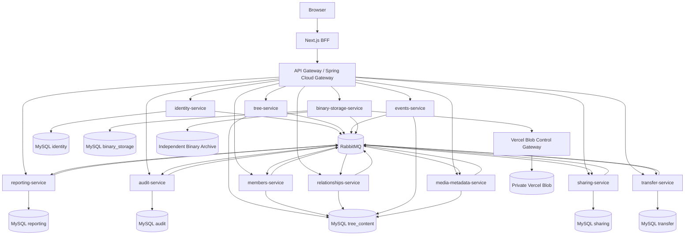

# Design Document: Microservice Decomposition

## Status and Dependencies

**DRAFT — RESEARCH / EDUCATIONAL SPEC**

This design implements `requirements.md` in this same directory. It is a parallel alternative to `../spring-boot-backend-migration/design.md`. The two designs share the same domain vocabulary but differ in transaction model, deployment, and operational practice.

Conventions:

- Each service is a Maven project under `services/<service-name>/`.
- Shared libraries live under `libs/` and are versioned snapshots.
- Local infrastructure (MySQL, broker) is declared via `infra/docker-compose.yml`.
- The Next.js BFF remains the only consumer-facing entry point.

## Design Goals

1. Each bounded context is a deployable service with its own schema.
2. Cross-service consistency is achieved through events + sagas + reconciliation, never distributed transactions.
3. Every service is observable, contract-tested, and independently deployable.
4. The legacy tree-content monolith is reproduced as a service-map whose failure modes are documented and explored.
5. Local development runs on a single laptop with Docker Compose.

## Non-Goals

- Multi-region.
- Polyglot persistence.
- Polyglot language choice (all services are Java + Spring Boot 4.1.0).
- Native-image delivery.
- Production ASVS 5.0 Level 2.

## Key Decisions

### Tree-content split strategy (ADR-101)

Two strategies evaluated:

| Strategy | Atomicity | Operational cost | Practical for genealogy |
|---|---|---|---|
| **A**: Keep tree-content as one service | High within service; cross-service via saga | Lowest | Yes |
| **B**: Split by aggregate (`members`, `relationships`, `events`, `media`, `albums`) | None across services; must compensate for every cross-aggregate invariant | High | Taxing but instructive |

**Decision:** Strategy B is implemented. The user's goal is to learn the trade-offs firsthand. The spec deliberately accepts distributed-consistency cost in exchange for studying it.

Sub-splits:

- `members-service` owns the `members` table and inserts into `members` directly.
- `relationships-service` owns the `relationships` table and validates cycles against a `relationships_graph` projection that it maintains from `MemberCreated` / `MemberDeleted` events.
- `events-service` owns `events`, `event_members`, `event_media`.
- `media-metadata-service` owns `media_objects` and association tables `media_members`, `member_avatars`, `album_media`, `albums` (albums are a media classification).
- `tree-service` owns `family_trees` and `tree_memberships`.

> Documented consequence: there is no longer a single tree-row lock. Concurrent graph mutations are serialised only within `relationships-service`.

### Saga style (ADR-102)

Choreography for fan-out (publishing `MemberCreated` triggers multiple consumers). Orchestration for import/export, member-cascade-deletion, and tree deletion because the compensation steps are non-trivial.

### Broker (ADR-103)

Embedded in dev: a single-process broker based on a shared outbox table per service plus a `broker-relay` process that reads each outbox and writes to a RabbitMQ instance in Docker Compose. RabbitMQ is chosen because it is well-understood and has a Spring Boot starter; no Kafka dependency is introduced.

### Clock policy (ADR-104)

Each service uses UTC `Instant` and a shared `Clock` bean. Saga ordering uses logical timestamps derived from `Instant` + a per-aggregate monotonic counter; cross-service ordering is best-effort with reconciliation.

### Consistency SLA (ADR-105)

| Invariant | SLA | Mechanism |
|---|---|---|
| Identity single-writer | Strict | Local MySQL row in `identity-service`. |
| Member→Media link tree scope | Eventually consistent ≤ 30 s | Event + projection. |
| Tree revision increments | Eventually consistent across services | Outbox event `TreeRevisionIncremented`. |
| Share link revocation | Immediate | Local write in `sharing-service`. |
| Audit log completeness | Eventually consistent; bounded lag | Audit fan-in + reconciliation. |
| Generated artifact result freshness | Eventually consistent | Job status row in `transfer-service`. |

## Architecture



## Trust Boundaries

- Browser is untrusted.
- Next.js BFF is the only path browser traffic takes.
- API Gateway authenticates the user via `identity-service` (session validation) and forwards user context as a signed token (à la the bridge token in the monolith spec).
- Service-to-service calls use mTLS in Docker Compose via a local CA.
- Outbox events are signed by the producing service; consumers verify signatures.
- Database access is private to each service's container.

## Service Catalogue

### identity-service

| Concern | Detail |
|---|---|
| Owns | `users`, `oauth_accounts`, `verification_tokens`, `auth_sessions`, `password_reset_tokens` |
| Hexagonal | Yes — same as monolith |
| Outbox | Yes |
| Emits | `UserCreated`, `UserVerified`, `UserLocked`, `UserLoggedIn`, `SessionCreated`, `SessionRevoked`, `OAuthLinked` |
| Consumes | None |
| Notes | Globally consistent; no second writer. |

### tree-service

| Concern | Detail |
|---|---|
| Owns | `family_trees`, `tree_memberships`, `tree_authority` |
| Hexagonal | Yes |
| Outbox | Yes |
| Emits | `TreeCreated`, `TreeDeleted`, `TreeRevisionIncremented`, `MembershipAdded`, `MembershipRemoved`, `MembershipRoleChanged` |
| Consumes | For reconciliation only |
| Notes | Authoritative for tree-level routing state. |

### members-service

| Concern | Detail |
|---|---|
| Owns | `members` |
| Hexagonal | Yes |
| Outbox | Yes |
| Emits | `MemberCreated`, `MemberUpdated`, `MemberDeleted` |
| Consumes | `TreeDeleted` (cascade-delete notification) |
| Notes | Carries state for foreign services in commands where synchronous read is needed. |

### relationships-service

| Concern | Detail |
|---|---|
| Owns | `relationships`, `relationships_graph` (projection) |
| Hexagonal | Yes |
| Outbox | Yes |
| Emits | `RelationshipCreated`, `RelationshipDeleted` |
| Consumes | `MemberCreated`, `MemberDeleted`, `MemberUpdated` (for graph projection) |
| Notes | Owns cycle detection. Rejects duplicates via unique constraint. |

### events-service

| Concern | Detail |
|---|---|
| Owns | `events`, `event_members`, `event_media` |
| Hexagonal | Yes |
| Outbox | Yes |
| Emits | `EventCreated`, `EventUpdated`, `EventDeleted`, `EventMemberLinked`, `EventMediaLinked` |
| Consumes | `MemberDeleted`, `MediaDeleted` (cascade) |
| Notes | Same-tree check enforced via inbound `tree_key` carrier and projection. |

### media-metadata-service

| Concern | Detail |
|---|---|
| Owns | `media_objects`, `media_members`, `member_avatars`, `albums`, `album_media` |
| Hexagonal | Yes |
| Outbox | Yes |
| Emits | `MediaActivated`, `MediaDeleted`, `AlbumCreated`, `AlbumDeleted`, `AvatarSet` |
| Consumes | `MemberDeleted`, `EventDeleted`, `TreeDeleted` (cascade) |
| Notes | Interacts with `binary-storage-service` via `MediaActivationRequested` command. |

### binary-storage-service

| Concern | Detail |
|---|---|
| Owns | `upload_intents`, `file_cleanup_jobs`, `binary_replicas` |
| Hexagonal | Yes |
| Outbox | Yes |
| Emits | `UploadIntentCreated`, `UploadCompleted`, `ScanSucceeded`, `ScanFailed`, `Promoted`, `CleanupRequested`, `CleanupCompleted`, `ReplicaRecorded` |
| Consumes | `MemberDeleted`, `MediaDeleted`, `EventDeleted`, `TreeDeleted` (cleanup requests) |
| Notes | This is the only service that talks to the Vercel Blob control gateway. |

### sharing-service

| Concern | Detail |
|---|---|
| Owns | `share_links`, `public_tree_projection` |
| Hexagonal | Yes |
| Outbox | Yes |
| Emits | `ShareLinkCreated`, `ShareLinkRevoked`, `ShareLinkAccessed` |
| Consumes | `TreeCreated`, `TreeDeleted`, `MemberCreated`, `MemberUpdated`, `MemberDeleted`, `RelationshipCreated`, `RelationshipDeleted`, `EventCreated`, `EventUpdated`, `EventDeleted`, `MediaActivated`, `MediaDeleted` |
| Notes | Public view is rebuilt from events. Immediate revocation is local. |

### transfer-service

| Concern | Detail |
|---|---|
| Owns | `import_jobs`, `generated_artifact_jobs`, `tree_snapshots`, `export_jobs` |
| Hexagonal | Yes |
| Outbox | Yes |
| Emits | `ImportStarted`, `ImportCompleted`, `ImportFailed`, `SnapshotCreated`, `SnapshotRestored`, `ArtifactJobCreated`, `ArtifactJobCompleted` |
| Consumes | All `*Created` / `*Deleted` events for snapshot capture |
| Notes | Orchestrates import/restore via Saga. |

### reporting-service

| Concern | Detail |
|---|---|
| Owns | `search_index`, `stats_cache`, `report_runs` |
| Hexagonal | Yes |
| Outbox | Yes |
| Emits | `SearchIndexUpdated`, `ReportCached` |
| Consumes | All `*Created` / `*Updated` / `*Deleted` events |
| Notes | Eventually consistent read-side. |

### audit-service

| Concern | Detail |
|---|---|
| Owns | `business_audit`, `security_audit`, `idempotency`, `processed_commands` |
| Hexagonal | Yes |
| Outbox | Yes |
| Emits | `AuditRecorded`, `SecurityAuditRecorded` |
| Consumes | All audit-relevant events |
| Notes | Idempotency registry is consulted by orchestrator. |

## Sagas

| Saga | Style | Steps | Compensation |
|---|---|---|---|
| `RegisterSaga` | Orchestration | identity.create → identity.verification.email → audit.record | delete user (compensating) |
| `CreateTreeSaga` | Orchestration | tree.create → tree-membership.owner → audit.record → reporting.refresh | delete tree, drop membership |
| `CreateMemberSaga` | Orchestration | members.create → audit.record → reporting.refresh → sharing.refresh | delete member |
| `DeleteMemberSaga` | Orchestration | relationships.delete → events.unlink → media.unlink → members.delete → audit.record | re-insert (best-effort) |
| `CreateRelationshipSaga` | Orchestration | relationships.graph.lock → relationships.create → audit.record → reporting.refresh → sharing.refresh | delete relationship |
| `CreateEventSaga` | Orchestration | events.create → events.link → audit.record → reporting.refresh | delete event |
| `UploadMediaSaga` | Choreography | binary-storage.activate → media-metadata.activate → audit.record → reporting.refresh | tombstones + cleanup |
| `DeleteMediaSaga` | Orchestration | media-metadata.tombstone → binary-storage.cleanup → audit.record | reverse cleanup |
| `DeleteTreeSaga` | Orchestration | tree.freeze → members.cascade → relationships.cascade → events.cascade → media.cascade → sharing.cascade → tree.delete → audit.record | saga log + manual investigation |
| `ImportSaga` | Orchestration | transfer.parse → identity.permission → bulk inserts across services → audit.record | rollback per service |
| `RestoreSnapshotSaga` | Orchestration | safety-snapshot → transfer.restore → reconcile → audit.record | rollback to safety snapshot |

All sagas are implemented in `transfer-service` for import/export/restore, and in `tree-service` for tree-level cascades. The `orchestrator` is a thin Spring Boot module that delegates to the participating services.

## Cross-Service Constraints

| Constraint | Old | New |
|---|---|---|
| Composite same-tree FKs | DB constraint | Application-level invariant; re-checked on apply by every service consuming `tree_key` |
| Member deletion cascades every link | One DB transaction | Saga with compensations; reconciliation catches drift |
| Tree revision monotonic | One DB row | `tree-service` increments; consumers receive `TreeRevisionIncremented` event |
| Avatar references same-tree image | DB FK | Application-level invariant + projection |
| Audit logged in same transaction as mutation | One DB transaction | Outbox event → audit-service consumer applies within bounded lag |
| Idempotency-Key | Local row | `audit-service` idempotency registry |

## Failure Modes

| Mode | Behaviour | Tooling |
|---|---|---|
| Event lost | Outbox relay retries with idempotency; reconciliation catches gaps | RabbitMQ publisher confirms, audit replay |
| Event duplicated | Consumers idempotent via idempotency-key | All event handlers check registry |
| Event out-of-order | Reconciliation re-derives state | Reconciliation jobs |
| Service slow | Circuit breaker opens; saga compensates | Resilience4j |
| Service down | BFF returns 503; saga pauses; pending items in outbox | Saga log + operator runbook |
| DB drift | Reconciliation finds drift; operator triggers replay | Per-service reconcile jobs |
| Saga stuck | Operator can replay/compensate | Saga log table |
| Broker down | Outbox grows; relay retries | RabbitMQ HA in dev (single-node + persistence) |

## Observability

- OpenTelemetry SDK with OTLP exporter.
- Logs: structured JSON with `service.name`, `trace_id`, `request_id`.
- Metrics: per-service p95/p99 latency, error rate, outbox lag, queue age, reconciliation drift count.
- Dashboards: Grafana JSON in `infra/grafana/`.
- Alerts: simple Alertmanager rules for retry storms, outbox lag, drift.

## Local Development

```text
infra/
  docker-compose.yml          # services + MySQL + RabbitMQ + Grafana
  seed/                       # import seed for fresh dev
services/
  identity-service/
  tree-service/
  members-service/
  relationships-service/
  events-service/
  media-metadata-service/
  binary-storage-service/
  sharing-service/
  transfer-service/
  reporting-service/
  audit-service/
libs/
  contract-types/             # generated DTOs shared across services
  outbox-relay/               # drop-in library for outbox publishing
  saga-framework/             # orchestrator + compensation
  clock/                      # shared clock bean
  tracing/                    # OpenTelemetry config
```

## API Versioning

- v1 contract is the legacy Next.js contract exposed via the BFF (no break).
- v2 contract is published per service with `/v2/*` prefix and consumed by the BFF.
- Internal service APIs use `/internal/v1/*` and are NOT documented in user-facing OpenAPI.

## Event Format

```json
{
  "eventId": "uuid",
  "eventType": "MemberCreated",
  "schemaVersion": 1,
  "occurredAt": "2026-07-25T09:23:50Z",
  "source": "members-service",
  "aggregateId": "member_xyz",
  "treeKey": 42,
  "payload": { "...": "..." },
  "signature": "<base64>"
}
```

Each event has a JSON schema in `infra/schemas/`. Schema registry is a checked-in folder.

## Security Model

- API Gateway validates the session via `identity-service` and forwards a short-lived JWT (≤ 5 min) with claims `user_key`, `roles`, `csrf`.
- Service-to-service traffic uses mTLS with a local CA (`infra/ca/`).
- Each service rotates its service-account JWT every 24 hours.
- Outbox events are signed by a per-service key; consumers verify signature before apply.

## Deployment

- Docker Compose for local dev.
- Docker Swarm or Kubernetes for higher environments (out of scope; documented for reference).
- Each service has its own CI pipeline; the only shared policy is the contract schema check.

## Migration Strategy from Monolith

> This section is exploratory because the user is choosing to keep the monolith as production while running this spec as a research lane.

1. Build a content-export tool that snapshots the monolith's MySQL and produces per-service seed files.
2. Stand up each service locally with empty schemas; apply seed in dependency order: identity → tree → members → relationships → events → media-metadata → sharing → reporting → audit.
3. Run dual-write readers in the monolith for a small feature (e.g., reporting) to validate the event flow before switching.
4. Pick a non-critical feature (e.g., search) as the first end-to-end service-only flow.
5. Document every divergence and update this spec with the lessons.

## Correctness Properties

1. **Local ACID:** every service's local mutation is atomic.
2. **Idempotency:** re-applying an event yields the same state.
3. **Saga convergence:** on success, all services reach the expected final state; on failure, compensation reaches a known-consistent state.
4. **Outbox at-least-once:** every local commit produces an outbox row; relay publishes it.
5. **Reconciliation catches drift:** if a service falls behind, the reconciler converges within the SLA.
6. **Contract backward-compatibility:** consumer always has a working version; major-version bump is gated.
7. **No schema-per-service cross-read:** enforced by separate schemas and integration tests.

## Research Methodology

1. Reproduce the same workload (scripted) against monolith and microservice.
2. Measure end-to-end latency, error rate, retry count, drift count, lines of code.
3. Document qualitative observations (debugging experience, observability clarity, deployment complexity).
4. Produce a comparison report and a blog-style write-up.

## Known Limitations

- This is research-grade; the comparison is not production-grade.
- Eventual consistency violates several requirements of the legacy monolith spec; this is intentional.
- Some invariants that previously relied on same-DB transactions are now best-effort.
