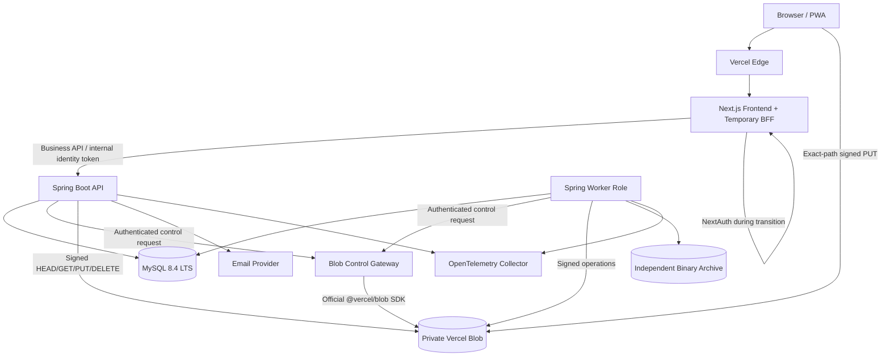
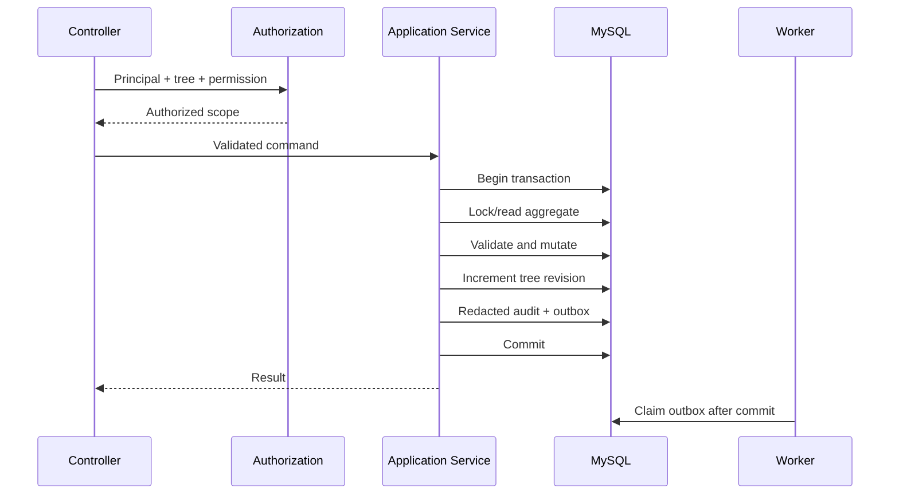
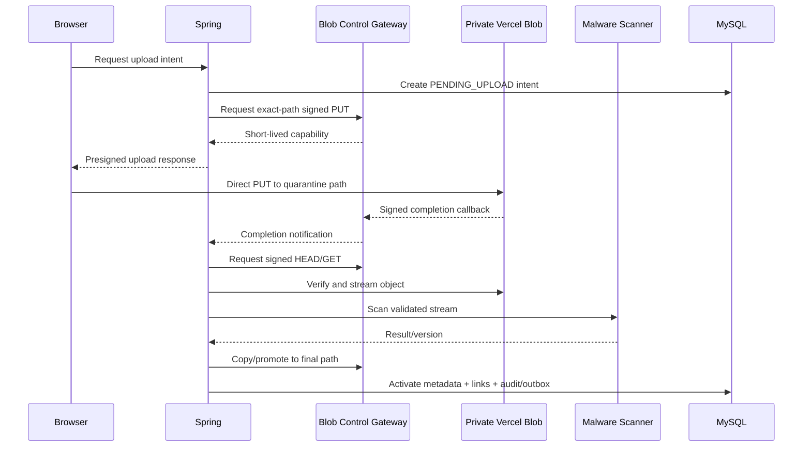

# Design Document: Spring Boot Backend Migration

## Status and Dependencies

**READY FOR IMPLEMENTATION PLANNING**

This design implements `requirements.md`. It migrates the existing Next.js route-handler backend to Spring Boot while retaining Next.js as frontend and temporary BFF. Existing API behavior remains authoritative unless this document explicitly identifies a security correction or V2 change.

## Design Goals

1. Move every structured/security record to MySQL with ACID transactions and referential integrity.
2. Retain private Vercel Blob for binary objects without exposing store-wide credentials to Spring or browsers.
3. Preserve API compatibility and existing credentials/OAuth accounts during an incremental strangler migration.
4. Enforce single-writer ownership for trees and global identity at every migration stage.
5. Keep tightly coupled genealogy mutations inside local database transactions.
6. Make external file effects recoverable through intents, outbox, durable cleanup and reconciliation.
7. Meet OWASP ASVS 5.0 Level 2 and production observability/DR requirements.
8. Support immediate route rollback during the bounded compatibility window.

## Non-Goals

- Microservice decomposition
- Event streaming infrastructure without measured demand
- Moving binary storage away from Vercel Blob
- Frontend UX redesign
- Unversioned public API cleanup
- Native image optimization before JVM performance evidence

## Key Decisions

### Modular monolith

The target is one Spring Boot deployable with strongly isolated modules. The genealogy domain requires transactions spanning members, relationships, events and media associations; splitting this work across services would introduce distributed consistency without business benefit.

### Hexagonal Architecture

Each module follows:

```text
Inbound Adapter -> Inbound Port -> Application Service -> Domain Model
                                              |
                                              v
                                       Outbound Port <- Outbound Adapter
```

Rules:

1. Domain code depends only on Java.
2. Application code depends on domain and ports.
3. Web, scheduler and worker DTOs remain adapters.
4. SQL records and Vercel DTOs never become domain objects.
5. Cross-module writes occur only through published application ports.
6. Reporting may use approved read projections but cannot mutate another module's tables.
7. ArchUnit verifies dependency direction and absence of module cycles.

### MySQL owns structured state

MySQL 8.4 LTS is the only target runtime authority for users, OAuth accounts, trees, memberships, members, relationships, events, media metadata, associations, albums, share links, audit, idempotency, jobs and snapshots. Blob JSON becomes immutable migration/rollback material.

### Blob control plane separated from data plane

Vercel has an official JavaScript SDK but no official Java SDK. A small Vercel-hosted control gateway uses `@vercel/blob` to issue exact-path Vercel Signed URLs and run listing/copy operations. Binary bytes travel directly through signed URLs. They are not proxied through a Vercel Function because the Function request/response limit is 4.5 MB while current uploads allow 10 MiB.

### One writer at all times

Each tree has a routing ownership state: `LEGACY`, `MIGRATING`, `SPRING`, or `ROLLBACK`. Only the owner backend can mutate it. Identity uses a separate global switch because `users.json` is shared by every tree.

### No distributed transaction

MySQL and Vercel Blob never share one atomic transaction. Uploads use two short transactions around external work. Deletions commit tombstone/cleanup intent first, then execute Blob deletion asynchronously.

### Safe share projection is an intentional breaking correction

The current share payload can expose private member fields and raw Blob URLs. The target introduces a strict allowlisted public DTO and dedicated share-media operation. Contract parity explicitly excludes the unsafe field set.

## Architecture



## Trust Boundaries

- Browser, multipart contents, callback claims and route parameters are untrusted.
- Edge-provided identity headers are ignored unless cryptographically bound to the internal JWT.
- Spring-to-control-gateway calls use TLS plus audience-bound service authentication, timestamp, nonce and body digest.
- Signed Blob URLs are bearer capabilities and must not be logged or persisted in domain tables.
- MySQL is private-network only.
- Binary archive uses credentials independent of the primary Blob store.

## Module Design

| Module | Responsibilities | Owned tables |
|---|---|---|
| `platform-kernel` | IDs, clocks, errors, pagination, principal types | None |
| `identity-access` | Users, credentials, OAuth, verification, lockout, sessions | `users`, `oauth_accounts`, `verification_tokens`, `auth_sessions` |
| `tree-content` | Trees, memberships, members, relationships, events, media metadata, albums, associations, graph algorithms | `family_trees`, `tree_memberships`, `members`, `relationships`, `events`, `event_members`, `media_objects`, `media_members`, `event_media`, `member_avatars`, `albums`, `album_media` |
| `binary-storage` | Signed Blob control, upload intents, quarantine, scan, cleanup, replication, reconciliation | `upload_intents`, `file_cleanup_jobs`, `binary_replicas` |
| `sharing` | Share-link lifecycle and safe public projection | `share_links` |
| `transfer` | Import, export, generated artifacts, snapshots, restore | `import_jobs`, `generated_artifact_jobs`, `tree_snapshots` |
| `reporting-search` | Search, autocomplete, statistics, document projection | Read-only projections/search columns |
| `audit-operations` | Business audit, security audit, idempotency, outbox | `audit_logs`, `security_audit_logs`, `processed_commands`, `outbox_events` |
| `app-bootstrap` | Runtime wiring, security chains, profiles, Actuator | None |

All transactionally coupled tree-content tables share one owner. Genealogy, calendar, album and media-metadata are feature packages inside `tree-content`, preventing cyclic module writes during member deletion, merge, import and restore.

Recommended layout:

```text
backend/
  pom.xml
  app-bootstrap/
  platform-kernel/
  identity-access/
  tree-content/
  binary-storage/
  sharing/
  transfer/
  reporting-search/
  audit-operations/
```

Per-module layout:

```text
<module>/src/main/java/.../<module>/
  domain/model/
  domain/service/
  domain/event/
  application/port/in/
  application/port/out/
  application/command/
  application/query/
  application/service/
  adapter/in/web/
  adapter/in/worker/
  adapter/out/mysql/
  adapter/out/http/
  config/
```

## Technology Baseline

| Concern | Selection |
|---|---|
| Runtime | Java 25 LTS |
| Framework | Spring Boot 4.1.0 |
| Web | Spring MVC |
| Security | Spring Security managed by Boot BOM |
| Persistence | Spring Data JDBC plus `JdbcClient` projections |
| Schema | Flyway Core plus Boot-compatible `flyway-mysql` |
| Database | MySQL 8.4 LTS / InnoDB |
| Validation | Jakarta Bean Validation |
| HTTP Client | Spring `RestClient` |
| Testing | Boot-managed JUnit Jupiter/Platform, AssertJ, Mockito, Testcontainers, WireMock; jqwik after compatibility check |
| Architecture | ArchUnit |
| Observability | Actuator, Micrometer, OpenTelemetry |
| Build | Maven Wrapper, reproducible builds |
| Packaging | Signed OCI image, non-root runtime |

Spring Boot BOM is authoritative. Version overrides require an ADR, compatibility proof, license check and vulnerability review.

## Core Ports

### Inbound Ports

```text
RegisterUserUseCase
VerifyEmailUseCase
AuthenticateUserUseCase
ManageSessionUseCase
ManageTreeUseCase
AssignTreeRoleUseCase
ManageMemberUseCase
MergeMemberUseCase
ManageRelationshipUseCase
ValidateRelationshipUseCase
ManageEventUseCase
ManageMediaUseCase
ManageAlbumUseCase
SearchTreeUseCase
ImportTreeUseCase
ExportTreeUseCase
GenerateReportUseCase
ManageGeneratedArtifactJobUseCase
ManageShareLinkUseCase
ReadSharedMediaUseCase
ManageTreeSnapshotUseCase
```

`MergeMemberUseCase` remains internal until a public contract is approved. Audit retrieval likewise remains internal/privileged.

### Outbound Ports

```text
UserRepository
TreeRepository
MemberRepository
RelationshipRepository
EventRepository
MediaRepository
BinaryObjectStore
BinaryArchive
MalwareScanner
EmailSender
PasswordHasher
SessionStore
OAuthIdentityProvider
AuditWriter
OutboxRepository
IdempotencyRepository
TelemetryPublisher
LegacyIdentityVerifier
LegacyProjectionWriter
```

## MySQL Data Design

### Conventions

- `ENGINE=InnoDB`, `ROW_FORMAT=DYNAMIC`.
- Human text and external IDs use `utf8mb4`; exact external IDs use `utf8mb4_bin`.
- Internal primary/foreign keys use `BIGINT UNSIGNED`.
- APIs continue exposing unchanged external IDs stored as `VARCHAR(300)`.
- Externally addressed tree entities have unique `(tree_key, external_id)`.
- SHA-256 values use `BINARY(32)`; ETag remains an opaque string.
- Calendar values use `DATE` and `LocalDate`.
- Instants use UTC `DATETIME(6)` with explicit `Instant` ↔ UTC `LocalDateTime` converters.
- Every mutable aggregate has `version BIGINT UNSIGNED NOT NULL DEFAULT 1` and UTC timestamps.
- Flyway is the only production migration mechanism.
- Executable DDL is accompanied by a complete column data dictionary.

### Identity Tables

#### `users`

```text
user_key BIGINT UNSIGNED PK
external_id VARCHAR(300) UNIQUE
email VARCHAR(254) UNIQUE normalized
name VARCHAR(200)
password_hash VARCHAR(255) NULL
image_url VARCHAR(2048) NULL
email_verified_at DATETIME(6) NULL
failed_login_attempts SMALLINT UNSIGNED
locked_until DATETIME(6) NULL
version, created_at, updated_at, deleted_at
```

#### `oauth_accounts`

- Unique `(provider, provider_account_id)`.
- FK to user with cascade.
- Provider check for Google/Facebook.
- Future provider credentials use KMS-backed envelope encryption when storage is required.

#### `verification_tokens` and `auth_sessions`

- Raw tokens are never persisted; store SHA-256 hashes.
- Verification tokens track expiry/consumption.
- Opaque sessions track idle/absolute expiry, rotation and revocation.

### Tree Tables

#### `family_trees`

```text
tree_key BIGINT UNSIGNED PK
external_id VARCHAR(300) UNIQUE
owner_user_key FK RESTRICT
name VARCHAR(200)
description VARCHAR(2000) NULL
revision BIGINT UNSIGNED
version, created_at, updated_at
```

#### `tree_memberships`

- PK `(tree_key, user_key)`.
- Role check `ADMIN|EDITOR|VIEWER`.
- Reverse index `(user_key, tree_key)`.
- Owner-admin invariant is enforced transactionally and reconciled continuously.

#### `members`

- Internal key and unique `(tree_key, external_id)`.
- Columns mirror `src/data/types.ts:56` and length limits in `src/data/schemas.ts:41`.
- Birth/death are `DATE`.
- Checks prevent death-before-birth and death with `is_alive=true`.
- Tree-first indexes cover name and common filters.
- Search-normalized columns are maintained in the same transaction.

#### `relationships`

- Internal key and unique `(tree_key, external_id)`.
- Composite same-tree FKs `(tree_key, source_member_key)` and `(tree_key, target_member_key)`.
- Canonical pair keys and unique logical relationship key.
- Graph changes acquire tree row lock before cycle validation.

#### `events` and associations

- Event internal key and unique `(tree_key, external_id)`.
- `event_members(tree_key,event_key,member_key,position)`.
- Composite FKs enforce same-tree membership.

#### `media_objects` and associations

Lifecycle:

```text
PENDING_UPLOAD -> PENDING_SCAN -> ACTIVE -> DELETING
       |               |            |
       v               v            v
    FAILED          FAILED     RETENTION_HELD -> DELETED
       |
       v
   ORPHANED
```

Metadata includes original/thumbnail paths, opaque ETags, independent SHA-256, MIME, size, caption, taken-at precision, uploader, scan engine/result/version, replication state and version.

All associations include `tree_key` and composite same-tree FKs:

```text
media_members(tree_key, media_key, member_key, position)
event_media(tree_key, event_key, media_key, position)
member_avatars(tree_key, member_key, media_key)
album_media(tree_key, media_key, album_key)
```

`event_media` is the sole event/media source of truth.

### Security and Operational Tables

- `share_links`: token hash, version, nonce, expiry, revoke timestamp, creator.
- `audit_logs`: allowlisted business history with redaction/field encryption.
- `security_audit_logs`: security events under separate retention/access policy.
- `processed_commands`: idempotency scope, key, request hash, cached result and expiry.
- `outbox_events`: aggregate, event type, allowlisted payload, lease, attempts, status.
- `upload_intents`: quarantine/final paths, expected constraints, expiry and lifecycle.
- `file_cleanup_jobs`: object key, expected ETag, reason, `available_at`, lease and attempts.
- `binary_replicas`: primary/archive locations, checksums, status and replicated time.
- `import_jobs`: input checksum, mode, strategy, counts, errors and status.
- `generated_artifact_jobs`: owner, tree, operation, normalized option hash, status, progress, cancellation, result object, expiry and errors.
- `tree_snapshots`: schema version, payload/object locator, checksum, counts and retention.

## Transaction and Locking Design

### Standard mutation



### Graph mutation locking

Every parent-child graph mutation:

1. Locks `family_trees` with `SELECT ... FOR UPDATE`.
2. Loads graph edges under that lock.
3. Validates candidate cycle and duplicates.
4. Mutates relationship, revision, audit and outbox.
5. Commits before releasing lock.

Lock order is tree first, then entity internal keys in ascending order. Concurrent adversarial tests prove only one conflicting mutation commits.

### Member deletion/merge

Because tree-content owns every association, member deletion and merge can atomically mutate member, relationship, event-member, media-member, event-media and avatar rows. Binary deletion requests are persisted as outbox/cleanup work before commit.

### Import

Parsing/checksum/reference validation occur outside the write transaction. Final import obtains tree lock/revision and commits accepted relational data, audit and outbox atomically.

### Report/export

Read projections are loaded in a read-only repeatable-read transaction. Expensive rendering runs after the coherent immutable projection has been built.

## Vercel Blob Design

### Control Gateway

The control gateway:

- Uses OIDC on Vercel where available.
- Authenticates Spring/Next server requests.
- Issues Signed URLs scoped to exact pathname, one operation and narrow expiry.
- Enforces content-type allowlist, maximum size and `allowOverwrite=false` for uploads.
- Verifies signed upload callbacks using `BLOB_WEBHOOK_PUBLIC_KEY`.
- Supports paginated listing and controlled copy/promotion.
- Never proxies media bytes.

Spring-to-gateway service signatures include method, canonical path, timestamp, nonce, body digest, issuer and audience. Verification keys support overlap during rotation.

### Upload Flow



Callback and browser result are hints only. Spring independently verifies size, MIME signature, checksum, parser limits, scan result and final object before activation.

### Download Flow

Authenticated media content is authorized before path resolution. Spring may stream from a signed GET or issue a very short-lived exact-path signed GET only after an approved security decision. Share media uses a dedicated token-scoped endpoint and never accepts a pathname.

### Deletion and Cleanup

1. Database transaction hides/tombstones metadata and inserts cleanup work.
2. Worker obtains exact-path signed DELETE with optional ETag precondition.
3. Delete is idempotent.
4. `RETENTION_HELD` delays physical deletion through rollback/legal retention.
5. Expired quarantine, abandoned multipart and orphan objects are reconciled.

### Binary Disaster Recovery

Every active original is copied to an independently credentialed encrypted archive within 24 hours. MySQL records primary/archive checksums and lag. Primary credentials cannot erase the archive; archive credentials cannot mutate the primary store. Restore drills repopulate Vercel Blob without reading the primary store.

## Authentication Design

### Transitional NextAuth Bridge

1. Keep `/api/auth/**` in NextAuth for session validation.
2. Next server validates the encrypted session cookie.
3. It mints an asymmetric internal JWT with `iss`, `aud`, `sub`, `iat`, `exp`, `jti` and auth strength.
4. Lifetime is at most five minutes.
5. Spring validates issuer, audience, algorithm, key, expiry and replay.
6. Browser never sees a persisted bridge token.

### Global Identity Cutover

1. Bulk-load users, OAuth accounts, verification and lockout state.
2. Complete Spring authentication before routing production mutations.
3. Freeze identity mutations for final delta, or use a MySQL-backed NextAuth compatibility adapter.
4. Reconcile normalized email/provider keys/state.
5. Atomically route all identity mutations to Spring.
6. Keep existing NextAuth JWT sessions working through the bridge until expiry.
7. Mark `users.json` read-only.

At no stage can Blob and MySQL mutate the same user independently.

### Final Sessions

Spring uses opaque server-side sessions with secure cookie flags, rotation, idle and absolute expiry, logout/revocation and CSRF. User-row locking serializes failed login counters. Verification/share/session tokens are hashed; provider refresh credentials are encrypted when stored.

## Authorization Design

| Role | Read | Create | Update | Delete content | Assign role/share |
|---|---:|---:|---:|---:|---:|
| Owner | Yes | Yes | Yes | Yes | Yes |
| ADMIN | Yes | Yes | Yes | Yes | Yes |
| EDITOR | Yes | Yes | Yes | Yes | No |
| VIEWER | Yes | No | No | No | No |
| Public share | Safe projection only | No | No | No | No |

Authorization is enforced at controller/method and application-service boundaries. Repository keys always include tree scope. Membership changes invalidate security caches. Client role/tree headers are never trusted.

## API Compatibility Design

- `adapter.in.web.legacy` preserves current URLs and DTO shapes.
- `adapter.in.web.v2` provides normalized envelopes, pagination, ETags, `If-Match`, required tree scope and idempotency.
- Golden fixtures compare status, payload, errors, redirects, cookies, cache/security headers and binary metadata.
- Unsafe legacy share fields are excluded from parity by a signed security-breaking-change record.
- Optional global ID scans receive deprecation headers and telemetry before removal.

## Search Design

- Normalized fields are updated in member transactions.
- Autocomplete uses tree-first prefix indexes.
- Filters use tree-first BTREE indexes.
- Legacy arbitrary substring may use bounded tree scan after profiling.
- FULLTEXT is accepted only after parity tests for Vietnamese, two-character terms, substring, rank and matched fields.
- If needed, an n-gram/search adapter is added behind `SearchTreeUseCase`; MySQL remains authoritative.

## Audit and Idempotency

Business audit stores only allowlisted/redacted fields. Passwords, hashes, credentials, tokens, Blob capabilities, file bytes and unnecessary PII are forbidden. Raw legacy audit source remains only in encrypted migration archive with explicit expiry if legally required.

Idempotency scope includes actor/tenant, operation and key. Same request hash returns cached result; a different hash returns 409. Offline PWA mutations persist the same key through retries.

Outbox rows are inserted with domain mutation. Workers claim rows using `FOR UPDATE SKIP LOCKED`, bounded batches, lease expiry and jittered retries. Exactly-once delivery is not claimed; handlers are idempotent.

## Backup Design

### Application snapshots

- Capture all tree-owned relational tables under repeatable-read.
- Include schema version, counts, checksum and binary manifest.
- Store private compressed snapshot with MySQL catalog row.
- Create safety snapshot before restore.
- Restore in one relational transaction and reconcile binaries afterward.
- Retain 30 days.

### Infrastructure recovery

Managed MySQL provides HA, encrypted backups, binlogs and PITR. Monthly automated restore and quarterly DR exercises validate ≤5 minute RPO and ≤60 minute RTO. Binary archive validates ≤24 hour RPO and ≤4 hour RTO.

## Caching

Start with Caffeine:

| Cache | TTL |
|---|---|
| Authorization | 15 seconds |
| Tree summaries | 30 seconds |
| Upcoming events | 30 seconds |
| Reports | 1–5 minutes |

Keys include tree revision. Redis is introduced only after measured multi-replica/session requirements. Auth, share, backup, export and mutation responses use no-store. Service-worker private caches are identity-versioned and cleared on logout/session loss/user switch.

## Observability

- Structured JSON logs with request/trace IDs, route template, outcome and duration.
- Pseudonymous actor/tree correlation only.
- Micrometer metrics for HTTP, HikariCP, slow queries, Blob operations, scanning, replication, outbox, jobs, auth and JVM.
- OpenTelemetry traces across Next BFF, Spring, MySQL, control gateway and email.
- No PII, tokens, URLs or pathnames in metric labels/log payloads.
- Liveness reflects process failure only.
- Readiness requires schema/database/security initialization, not Blob availability.

## Deployment

- Next.js remains on Vercel.
- Spring API and worker roles run from the same signed OCI image near MySQL.
- Runtime is non-root, read-only filesystem, bounded temp volume, CPU/memory limits and graceful shutdown.
- MySQL uses private networking and TLS.
- Vercel Blob stores/prefixes and credentials are environment-separated.
- CI promotes the identical image digest from staging to production.

## Security Design

- OWASP ASVS 5.0 Level 2 is the verification baseline.
- TLS everywhere, HSTS at edge, same-origin default and strict CORS.
- CSRF for cookie-authenticated unsafe methods.
- CSP, frame protection, `nosniff`, referrer and permissions policies.
- Parameterized SQL and strict input size/depth/count bounds.
- Mandatory malware scan and fail-closed quarantine.
- Rate limits for auth, share, upload, import and export.
- Managed secrets with key IDs and overlap rotation.
- SAST/SCA/secret/container/IaC/license scans, CycloneDX SBOM, signed image and provenance.
- No unresolved critical/high finding without approved time-bounded exception.

### Retention and erasure

- A versioned retention policy maps each data class to legal basis, minimum/maximum lifetime, legal-hold behavior and deletion/anonymization action.
- Separate schedules apply to genealogy PII, business audit, security audit, sessions, verification tokens, idempotency records, jobs/artifacts, migration archives, snapshots and operational telemetry.
- Authorized erasure starts with a dependency preview covering tree ownership, memberships, member references, media, shares, audits and backups.
- Referential data is deleted, reassigned or pseudonymized according to policy; security/audit evidence retains only the minimum legally required representation.
- Legal holds suspend physical deletion and use explicit hold state.
- Retention workers are idempotent, leased, observable and produce tamper-evident completion evidence.
- Binary deletion never precedes rollback, legal-hold or retention deadlines; backup expiry and archive erasure are included in the workflow.

## Data Migration

### Source Mapping

| Source | Target |
|---|---|
| `data/users.json` | users, OAuth accounts, verification/lockout state |
| `data/trees.json` | trees, memberships |
| `members.json` | members, avatars |
| `relationships.json` | canonical relationships |
| `events.json` | events, event-members, candidate event-media links |
| `media-metadata.json` | media metadata and associations |
| `albums.json` | albums |
| `change-logs.json` | redacted business audit |
| Share index/token objects | hashed share links |
| Legacy backups | legacy snapshot catalog/archive |
| Media originals/thumbnails | remain in Blob and are reconciled |

### Extraction

- Enumerate prefixes with pagination.
- Capture pathname, opaque ETag, size, upload time, extraction time and schema variant.
- Hash structured record canonical JSON.
- Compute binary SHA-256 only by reading bytes or trusted application checksum; ETag is never a hash.
- Store immutable raw source and signed manifest.
- Record staging row source pathname and array index.

### Transformation

1. Preserve external IDs and timestamps.
2. Normalize emails; manual-review duplicates.
3. Convert OAuth empty password to null.
4. Deduplicate memberships and force owner admin.
5. Canonicalize relationships in source order and quarantine invalid/cyclic references.
6. Convert calendar values to valid date component.
7. Stable-deduplicate arrays.
8. Build media-member and event-media union from legacy scalar/array directions.
9. Validate `avatarMediaId` as same-tree image; preserve legacy `avatarUrl` as a read-only fallback when no managed avatar exists.
10. Derive object keys and verify required originals.
11. Hash share tokens.
12. Redact legacy audit into runtime tables; retain raw source only in controlled archive.

### Loading and Reconciliation

- Load users first, then each tree in isolated transaction.
- Use migration ledger keyed by source pathname/ETag.
- Rerunning same manifest is idempotent.
- Require exact accepted count/ID reconciliation.
- Run zero-result FK anti-joins and graph cycle checks.
- Compare canonical graph hashes, upcoming events, search and reports.
- Reconcile binary count/size/checksum as approved by discovery cost plan.
- Every difference is blocking or explicitly approved with owner.

## Cutover and Rollback

### Shadow reads

Eligible requests execute in Spring asynchronously while legacy response remains authoritative. Comparators normalize approved nondeterminism. Shadowing excludes secrets and unsafe binary payloads. Feature flags can stop shadowing without deployment.

### Per-tree cutover

1. Select cohort.
2. Freeze legacy tree writes.
3. Capture final ETags and delta.
4. Apply delta to MySQL.
5. Run blocking reconciliation.
6. Atomically switch tree ownership to Spring.
7. Unfreeze writes.
8. Observe SLO/parity/security.
9. Keep bounded reverse projection only for rollback.

### Identity cutover

Identity uses a global switch after Spring auth is complete. Registration, OAuth linking, verification and lockout never have two writers.

### Rollback

- Keep source JSON and binaries immutable through window.
- Delay cleanup with `RETENTION_HELD`.
- Reverse exporter reconstructs legacy collection shapes and denormalized links.
- Freeze writes before reverse export/switch.
- Validate legacy readers before routing rollback.
- Spring session rollback may require reauthentication.
- Preserve MySQL/staging for forensic reconciliation.

## Go/No-Go Criteria

### Go

- Zero blocking data discrepancy.
- Contract parity except approved security corrections.
- ASVS/security and penetration gates pass.
- Two cutover/rollback rehearsals meet RPO/RTO.
- MySQL and binary restores pass.
- Load/SLO tests pass.
- Alerts, dashboards and runbooks are active.
- Product, engineering, DBA, security and operations approve.

### Stop or rollback

- Any cross-tree disclosure.
- Blocking count/hash/graph discrepancy.
- SLO/error-budget stop threshold breached.
- Outbox/reverse projection exceeds RPO.
- Identity or routing allows two writers.
- Restore/rollback evidence is invalid.

## Key ADRs

| ID | Decision |
|---|---|
| ADR-001 | Modular monolith, not microservices |
| ADR-002 | Java 25 LTS, Spring Boot 4.1.0, MySQL 8.4 LTS |
| ADR-003 | Hexagonal Architecture per module |
| ADR-004 | MySQL is the only structured-data target authority |
| ADR-005 | Vercel Blob stores only private binary/artifact objects |
| ADR-006 | Official JS control gateway plus exact-path signed data plane |
| ADR-007 | Spring MVC, Spring Data JDBC and explicit SQL projections |
| ADR-008 | Outbox, upload intent and cleanup instead of distributed transaction |
| ADR-009 | NextAuth bridge followed by global identity single-writer cutover |
| ADR-010 | Legacy adapter plus versioned V2 API |
| ADR-011 | MySQL search and Caffeine first; add infrastructure by evidence |
| ADR-012 | Infrastructure DR is separate from user-level snapshots |
| ADR-013 | Per-tree cutover with no prolonged dual writes |
| ADR-014 | Strict allowlisted public share DTO |
| ADR-015 | Tree revision drives ETag and cache consistency |

## Correctness Properties

1. **Contract parity:** every non-exempt legacy fixture produces equivalent target behavior.
2. **Single writer:** no tree or user can be mutated by both backends.
3. **Tree isolation:** no association can reference another tree due to composite FKs.
4. **Graph acyclicity:** concurrent graph changes cannot commit a combined parent-child cycle.
5. **Idempotency:** replaying a command does not duplicate effects.
6. **Atomic structured mutation:** relational state, revision, audit and outbox commit together.
7. **No active unverified media:** ACTIVE implies required object, checksum, parser validation and successful scan.
8. **Private binary access:** no unauthenticated principal can derive arbitrary object access.
9. **Audit safety:** forbidden secrets/PII never enter runtime audit.
10. **Migration conservation:** source accepted/quarantined/approved-duplicate counts account for every record.
11. **Rollback recoverability:** Spring-owned state can be projected and validated for legacy readers during the rollback window.
12. **DR independence:** binary recovery succeeds without primary Blob access.

## Testing Strategy

### Unit and property tests

- Validation, date/state rules and recurrence
- Relationship normalization, generation, ancestry and concurrent cycle scenarios
- Search normalization and ranking
- Idempotency and audit redaction
- Import mapping and snapshot round trips
- Share projection/token rules

### Integration tests

- Exact MySQL 8.4 Testcontainers
- Flyway empty-to-current and previous-to-current migrations
- Transaction rollback, lock ordering and deadlocks
- Outbox leases/retries/dead letters
- Blob control gateway stubs and private staging store
- Signed URL operation/path/expiry restrictions
- Scanner and replication failures

### Contract and E2E tests

- Differential legacy/Spring HTTP fixtures
- Registration/login/OAuth mocks
- Tree/member/relationship/event/media workflows
- Offline mutation replay
- Import/export/report/snapshot/share flows
- IDOR, CSRF, injection, token, file and privacy attacks

### Performance and resilience tests

- Typical, p95 and maximum tree datasets
- API/search/upload/download/import/export/report load
- MySQL saturation and slow-query plans
- Blob throttling and scanner outage
- Worker backlog and failover
- Cutover and rollback rehearsals
