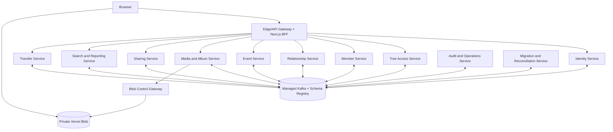

# Design: Spring Boot Microservices Migration

## Status and Traceability

**APPROVED — PHASE 1 AUTHORITATIVE BASELINE**

This design implements `requirements.md` and the standalone ADRs in `adrs/`. Requirements are authoritative. The modular-monolith design is superseded.

## Current vs Target Technology Baseline

The observed current repository state is a single Next.js 14 application using TypeScript, React 18, NextAuth, private Vercel Blob storage, TanStack Query, Zustand, Zod, Vitest, and fast-check. Its route handlers, TypeScript services, Blob records, client mutation behavior, offline queue, service worker, and behavioral tests are migration inputs only; they do not demonstrate that the target backend exists or define target service boundaries, persistence, or transaction semantics.

The target is independently deployable Spring Boot microservices. Java 25 LTS and Spring Boot 4.1.x are the approved initial baseline only after the compatibility gate in ADR-009 succeeds; no backend artifact or target directory described below is claimed to exist yet.

## Technology Stack

| Area | Selection | Classification |
|---|---|---|
| Frontend and bridge | Existing Next.js BFF during strangler migration; versioned OpenAPI and async operation polling | Mandatory transition capability |
| Service runtime | Java 25 LTS, Spring Boot 4.1.x, Maven Wrapper, Spring MVC, Spring Security, Spring for Apache Kafka, gRPC Java, Resilience4j, Micrometer/OpenTelemetry | Mandatory after compatibility gate |
| Data and messaging | MySQL 8.4, Flyway, Spring Data JDBC, jOOQ, managed Kafka-compatible platform, Schema Registry, Protobuf | Mandatory |
| Platform | Managed Kubernetes, Helm, Terraform, Argo CD, signed OCI images | Mandatory vendor-neutral tooling |
| Testing | JUnit 5, AssertJ, Mockito, Testcontainers, ArchUnit, language-neutral golden/property fixtures | Mandatory |
| Provider products | Cloud, managed MySQL/Kafka/KMS/observability implementations | Environment-specific; ADR required before provisioning |
| Search extension | OpenSearch | Conditional on benchmark and ADR |

## Architecture



The Gateway owns routing, WAF/rate limits, trace IDs, the NextAuth bridge, and the public async envelope; it owns no business state. Browser and Next.js call services only through the Gateway. Internal synchronous calls are deadline-bound gRPC for bounded lookups only, may not exceed two hops, and may not emulate distributed transactions.

## Service Boundaries and Data Ownership

| Service | Authoritative ownership | Important projections/dependencies |
|---|---|---|
| Identity | users, credentials, OAuth, verification, sessions, revocation | publishes identity events |
| Tree Access | trees, ownership, memberships, RBAC, revision/epoch | authoritative emergency permission lookup |
| Member | profiles, lifespan/status, normalized fields, avatar fallback, tombstones | local membership projection |
| Relationship | graph, canonical keys, graph algorithms | membership and member/tombstone projections |
| Event | events, recurrence, local member/media references | membership, member, media projections |
| Media & Album | media/album metadata, references, upload/lifecycle/cleanup | membership and domain-reference projections |
| Sharing | hashed links, revocation, allowlisted public view | tree/member/media projections |
| Search & Reporting | Vietnamese search, autocomplete, statistics/report read models | domain projections and watermarks |
| Transfer | import/export, artifacts, snapshots, restore Saga | all domain commands/replies |
| Audit & Operations | allowlisted audit projection, operation registry, operator APIs | never business or authorization authority |
| Migration & Reconciliation | source manifests, staging ledger, discrepancy/cutover state | participant watermarks and reconciliation endpoints |

Each service has a private MySQL 8.4 database/logical database, Flyway history, runtime identity, and deploy/rollback lifecycle. Network policy prevents database access by other services. Cross-service references are opaque IDs plus expected versions; integrity comes from command validation, projections, tombstones, and anti-entropy reconciliation, never foreign keys across services.

## Local Service Structure

Each independently deployable Spring service uses a traditional layered architecture organized by feature. These layers exist only inside a bounded context and do not weaken service, database, build, deployment, or domain ownership boundaries.

```text
com.<organization>.<service>/
  <feature>/
    controller/        # REST controllers, gRPC endpoints, Kafka consumers
    dto/               # transport request, response, and message DTOs
    mapper/            # inbound-boundary mappings
    service/           # use cases, transactions, authorization, Saga orchestration
    repository/        # persistence boundary and Spring Data JDBC/jOOQ implementations
    domain/             # entities, value objects, domain rules
    integration/        # Kafka producers and outbound gRPC clients
  config/
  shared/              # technical-only; no shared business domain
```

The mandatory dependency direction is `controller/consumer/endpoint -> service -> repository`, with the service layer also invoking feature-local integrations. Inbound components may not bypass services to access repositories. Services own use-case orchestration, local transaction boundaries, authorization coordination, owning-service Saga state machines, and outbound integration calls. Cross-feature collaboration uses another feature's service API or events, never its repository, internal transport DTOs, or persistence implementation.

Transport DTOs and mappers remain at inbound boundaries; domain entities, value objects, and rules do not depend on transport types or inbound components. Repositories encapsulate Spring Data JDBC and jOOQ: service classes may not use `DSLContext`, generated jOOQ types, or Spring Data repository implementations directly. Flyway migrations remain schema authority, Spring Data JDBC persists aggregates and transactional state, and jOOQ implements explicit SQL, read models, and projection queries with reproducible generation from the migrated schema.

ArchUnit enforces layer direction, repository encapsulation, transport isolation, cross-feature boundaries, and cross-service isolation. The service baseline includes Spring MVC, Spring Security, Spring for Apache Kafka, gRPC Java, Resilience4j, Micrometer/OpenTelemetry, JUnit 5, AssertJ, Mockito, Testcontainers, and ArchUnit.

A reusable versioned platform starter may provide security, telemetry, outbox/inbox, idempotency, gRPC policy, health checks, and test harnesses, but provides technical infrastructure only, imposes no generic architecture abstractions, and contains no shared business models. Saga state machines remain in the owning service; no external workflow engine is included in the baseline. Protobuf event contracts and Protobuf gRPC service contracts have separate generation, versioning, compatibility, and publication lifecycles.

## Project Architecture

The target logical monorepo layout is a delivery constraint, not a statement that these directories currently exist:

```text
/
  services/<service>/pom.xml, mvnw, src/, db/migration/, deploy/helm/, pipeline
  contracts/api/
  contracts/events/
  contracts/grpc/
  platform/starters/
  platform/terraform/
  environments/<environment>/gitops/
  tooling/
```

Each service owns its wrapper, build, pipeline, image, Flyway migrations, and Helm chart. Root tooling may catalog and orchestrate changed-service commands but must not be a Maven parent/reactor build. Services consume published starter and contract versions; they never import another service's source or domain model. Architecture checks prove that one service builds without building another and reject cross-service source dependencies.

## Messaging and Event Governance

Kafka-compatible messaging is mandatory. Topics are versioned by bounded context and partitioned by `treeId` (`userId` for identity). Protobuf event schemas are registered with backward compatibility under ADR-010. CI rejects incompatible/unversioned schemas and forbidden PII, secrets, and raw Blob URLs.

Every source mutation commits domain state, source audit, and outbox in one local transaction. Relay/CDC publishes after commit. Consumers record inbox/deduplication state with local effects, ignore audited stale versions, detect gaps, retry with jitter, and route poison messages to DLQ. Delivery is at least once; handlers and operator replay are idempotent.

Required metadata: `eventId`, `correlationId`, `causationId`, `operationId`, aggregate ID/version, occurred-at, schema version, and trace context.

## Async API and Operations

Cross-service mutations return:

```http
HTTP/1.1 202 Accepted
Content-Type: application/json

{"operationId":"...","status":"PENDING","statusUrl":"/api/v2/operations/..."}
```

The owning service orchestrates the Saga. Audit & Operations holds a queryable operation projection but no use-case logic. Standard states are `PENDING -> RUNNING -> SUCCEEDED | FAILED | COMPENSATING -> COMPENSATED | MANUAL_REVIEW`. Duplicate commands return the established operation. `SUCCEEDED` requires all mandatory participants to report the target tree revision/epoch.

Frontend migration changes mutation handling to poll the operation endpoint. Contract tests reject legacy assumptions of immediate cross-service completion.

## Authorization

Tree Access is authoritative for ownership, membership, role, and tree revision/epoch. Domain services consume ordered membership events into local authorization projections and authorize the normal request path locally.

Each authorization decision checks principal, tree, permission, and projection version. Unsafe mutation is denied when projection freshness is unknown or beyond threshold. Sensitive reads fail closed or use a deadline-bound emergency Access lookup. Revocation events receive priority monitoring and reconciliation. Client role/tree headers are never authoritative.

## Saga Designs

### Delete Member

Member tombstones the record, then the orchestrator commands Relationship to disable edges, Event to detach references, Media to detach media/avatar references, and Tree Access to advance revision. Visibility restoration is compensable only before irreversible cleanup.

### Delete Tree

Tree Access freezes writes and tombstones the tree, then domains purge or apply retention holds. Final relational deletion follows all required acknowledgements; physical binary deletion waits through rollback/retention deadlines.

### Media Activation

Media creates an upload intent, issues exact-path signed PUT to quarantine, independently verifies/scans, promotes the binary, activates metadata, then sends association commands. Association failure never makes an object publicly reachable.

### Import/Replace and Restore

Transfer parses/stages in isolated workers, validates a cross-domain manifest, freezes the tree, distributes staged writes under an import/restore epoch, verifies counts/hashes, coordinates per-service activation, reconciles binaries, and unfreezes. Pre-activation failure removes staging. Failure after partial activation enters explicit rollback or `MANUAL_REVIEW`; partial epochs remain hidden.

### Cutover

Identity and each tree use freeze, final delta, service/projection reconciliation, compare-and-set route authority, and unfreeze. Identity switches globally before tree cohorts. No dual writer or shadow mutation is permitted.

## Domain Preservation

- Member preserves validation, tombstones, internal duplicate/merge, and legacy avatar URL fallback.
- Relationship serializes graph commands by tree partition and aggregate version, enforces local unique logical keys, and preserves cycle/generation/ancestry/spouse/adoption behavior.
- Event preserves recurrence and February-29 behavior; references are local IDs/projections.
- Media preserves JPEG/PNG/WebP/PDF constraints, 10 MiB limit, exact-path no-overwrite upload, quarantine, fail-closed malware scan, 480×480 WebP thumbnails, delayed deletion, and independent archive.
- Sharing stores token hashes and serves an allowlisted projection; token plus media ID replaces path access.
- Search uses MySQL projections first; OpenSearch requires benchmark and ADR.
- Reports and snapshots use revision/watermark barriers rather than a global repeatable-read transaction.

## Current-to-Target Migration Map

This mapping records migration input; it does not carry legacy shared persistence, in-process calls, whole-document transactions, or TypeScript domain coupling into the target.

| Observed current area | Target bounded context |
|---|---|
| NextAuth routes and auth services | Identity |
| Tree and membership routes/services | Tree Access |
| Member routes/services and genealogy fixtures | Member |
| Relationship routes/services and graph algorithms | Relationship |
| Event routes/services and recurrence fixtures | Event |
| Media, album, upload, thumbnail, and Blob controls | Media & Album |
| Share routes and public projection logic | Sharing |
| Search, statistics, and report routes | Search & Reporting |
| Import, export, snapshot, and restore routes | Transfer |
| Audit records and operation status | Audit & Operations |
| Blob JSON extraction and discrepancy tooling | Migration & Reconciliation |
| TanStack Query mutations, hooks, offline queue, and service worker | Gateway/frontend async-contract consumers |

Language-neutral fixtures and invariants preserve behavior. Legacy Blob JSON extraction remains immutable and read-only and must not use mutation-on-read normalization paths.

## Blob Control and Data Plane

A small Vercel-hosted gateway uses the official JavaScript SDK for signed exact-path control operations. Browser uploads bytes directly to private quarantine, avoiding function payload limits. Signed URLs are bearer capabilities and are never logged or placed in events/domain tables. Vercel Blob stores binaries/artifacts only; each domain's MySQL remains authoritative for metadata.

## Migration and Cutover

1. Inventory legacy API/domain behavior and immutable Blob source.
2. Publish V2 async OpenAPI, event catalog, schemas, ownership, PII classification, retention, and partitioning.
3. Load Identity, then service-specific tree manifests idempotently.
4. Reconcile `source = accepted + quarantined + approved duplicate`, IDs/counts, dangling references, graph hashes, projections, reports, and binaries.
5. Shadow reads only.
6. Cut over global identity, then tree cohorts with automatic stop controls.
7. Retain immutable source and reverse-export capability through rollback window.

## Managed Platform

Production uses managed multi-AZ Kubernetes, managed MySQL 8.4 per service, and managed Kafka-compatible infrastructure with Schema Registry. Namespaces, service accounts, topic ACLs, database credentials, and NetworkPolicies isolate domains. Workload identity/mTLS, managed secrets/KMS, HPA/KEDA, PodDisruptionBudgets, topology spread, and resource quotas are required.

Helm packages each service, Terraform provisions infrastructure, and Argo CD reconciles environment GitOps state. These tools remain provider-neutral. Cloud and managed MySQL, Kafka, KMS, and observability products require an accepted environment ADR before provisioning.

OCI images are signed, include SBOM/provenance, run non-root with read-only filesystems, and promote the same digest. OpenTelemetry covers Gateway, REST/gRPC, Kafka, databases, workers, and Blob control. Alerts cover SLOs, outbox age, consumer lag, projection freshness, Saga failures, and cutover stops.

## Build and Release Workflow

1. A compatibility spike resolves Java 25, Spring Boot 4.1.x, Maven Wrapper, and the complete runtime/test matrix before scaffolding. Failure blocks work until a superseding ADR selects the nearest compatible Spring Boot GA.
2. Changed-service pipelines build and test only affected services and architecture checks reject root-reactor and cross-service source coupling.
3. Platform starters, OpenAPI contracts, event Protobuf artifacts, and gRPC Protobuf artifacts are versioned and published independently.
4. CI applies event-schema backward-compatibility/privacy gates and reproduces jOOQ generation from Flyway migrations.
5. Pipelines produce signed OCI images with SBOM and provenance. Argo CD promotes the same immutable digest between environments through reviewed Git state.

## Open Decision Register

| Decision still open | Required gate |
|---|---|
| Cloud and managed MySQL/Kafka/KMS/observability products per environment | Accepted environment ADR before provisioning |
| Numeric Saga-completion and projection-lag objectives | Approval before production writes |
| Numeric service/data/binary RPO and RTO thresholds | Approval before production writes and DR sign-off |

## Failure Handling

- Kafka outage: local outbox commits may continue within backlog/RPO policy; new mutation is blocked when outbox age exceeds threshold.
- Duplicate/reordered event: inbox and aggregate version deduplicate; gaps trigger replay/reconciliation.
- Participant outage: bounded retries/DLQ retain a visible non-success operation.
- Stale authorization: unsafe action fails closed.
- Partial import/restore: inactive epochs stay hidden; rollback/manual review is required.
- Database loss: restore owning databases in documented order, replay Kafka, and rebuild projections.
- Schema poison: registry CI gate, quarantine/DLQ, and replay tooling.

## Verification and Go/No-Go

Verification includes shared domain golden/property tests, MySQL 8.4 Testcontainers per service, Kafka duplicate/reorder/replay/outage tests, Saga transition fault injection, async OpenAPI/frontend contract tests, security abuse tests, reconciliation, architecture tests, load/SLO tests, and DR drills.

Production writes require two successful production-like cutover/rollback and DR rehearsals, zero blocking discrepancy, approved Saga/projection SLOs, passing ASVS/penetration gates, tested alerts/runbooks, and verified rollback projection. Legacy writers are removed only after rollback expiry and zero-traffic evidence.

## ADR Index

- `adrs/ADR-001-supersede-modular-monolith.md`
- `adrs/ADR-002-service-boundaries-and-database-ownership.md`
- `adrs/ADR-003-saga-and-eventual-consistency.md`
- `adrs/ADR-004-kafka-governance.md`
- `adrs/ADR-005-authorization-projections.md`
- `adrs/ADR-006-managed-kubernetes.md`
- `adrs/ADR-007-async-202-operation-contract.md`
- `adrs/ADR-008-coordinated-epoch-import-restore.md`
- `adrs/ADR-009-standardized-java-spring-technology-baseline.md`
- `adrs/ADR-010-protobuf-contract-strategy.md`
- `adrs/ADR-011-monorepo-independent-service-builds.md`
- `adrs/ADR-012-vendor-neutral-platform-and-provider-gates.md`
